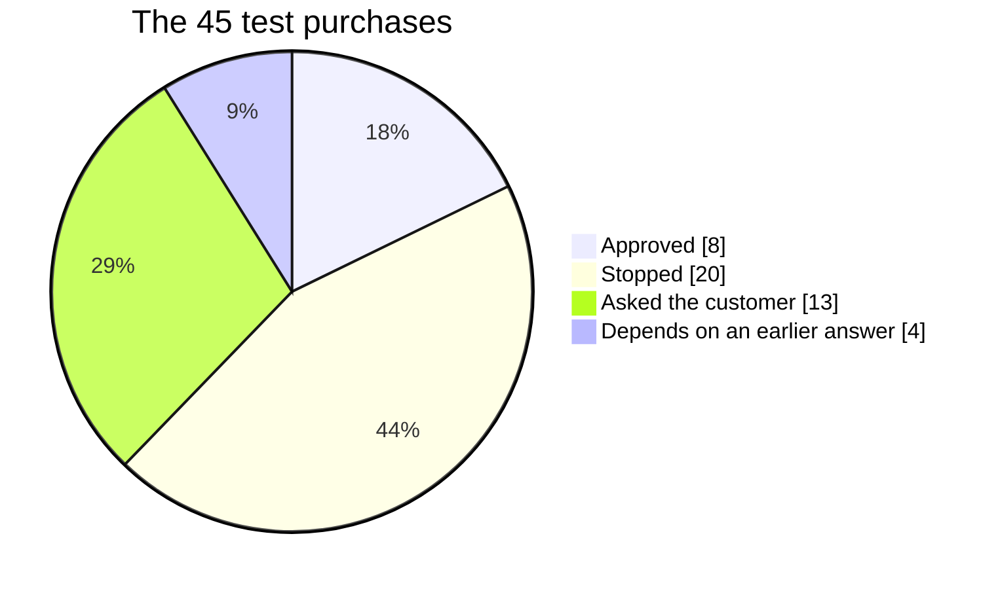

# OneGuard Policy Guide

What OneGuard checks before an AI shopping agent can pay with your card, what it does when
something looks wrong, and how it handled 45 test purchases. How to change the checks is
at the end of this file.

## Summary: what OneGuard protects

**Of 45 test purchases, 33 needed to be stopped or needed a question to the customer. A plain
spending limit catches only 6 of them. OneGuard catches all 33 and still lets the 8
ordinary purchases straight through.**

| | What happened | Purchases | CHF | Meaning |
|---|---|---:|---:|---|
| 🟢 | Approved | 8 | 1,042.55 | went through, no question asked |
| 🔴 | Stopped | 20 | 4,378.28 | broke a rule the customer set |
| 🟡 | Asked the customer | 13 | 3,080.40 | the customer decides on their phone within 2 minutes |
| ⚪ | Depends | 4 | 424.50 | on how the customer answered an earlier question |
| | **Total** | **45** | **8,925.73** | |

### Problem purchases stopped or asked (out of 33)

| Setup | Stopped or asked | Goes through unchecked |
|---|---|---:|
| No control | 🔴🔴🔴🔴🔴🔴🔴🔴🔴🔴 0 of 33 | CHF 7,458.68 |
| Plain spending limit | 🟢🟢🔴🔴🔴🔴🔴🔴🔴🔴 6 of 33 | CHF 5,732.68 |
| **OneGuard** | 🟢🟢🟢🟢🟢🟢🟢🟢🟢🟢 **33 of 33** | **CHF 0** |

A spending limit only looks at the price. OneGuard also looks at the shop, the items, the
terms and who seems to be shopping, and it still approves all 8 ordinary purchases.

### What a plain spending limit misses (27 purchases, CHF 5,732.68)

| What went wrong | Purchases | CHF |
|---|---:|---:|
| 🔴 A shop the customer never used, or a fake shop with a look-alike name | 6 | 1,448.28 |
| 🔴 The same item bought a second time | 6 | 1,798.40 |
| 🔴 The wrong item, or extras nobody asked for | 5 | 712.00 |
| 🔴 Returns not allowed, too short, or not stated | 3 | 478.00 |
| 🔴 The same order twice, or one order split in two | 2 | 354.00 |
| 🔴 Signs that someone else is using the card | 2 | 260.00 |
| 🔴 The wrong kind of shop | 1 | 189.00 |
| 🔴 A hidden monthly subscription | 1 | 194.00 |
| 🔴 Hidden instructions in the shop's text trying to trick the agent | 1 | 299.00 |

These results are judged against each customer's own instruction, using our answer key for
the 45 test purchases (`docs/acceptance-oracle.yaml`). "Plain spending limit" means a card
that only blocks amounts over the customer's per-order limit. Amounts come from
`data/purchase_attempts.csv`.

## What decided each purchase

| Reason | What happened | Purchases | Examples |
|---|---|---:|---|
| The customer never bought from this shop | Stopped | 6 | unknown shops, including the fake look-alike shop |
| Over the customer's limit per order | Stopped | 5 | 3 of them only 5–8% over |
| Not the item the customer asked for | Stopped | 3 | trail shoes, a helmet, a gift voucher |
| Returns too short, or no returns | Stopped | 2 | 7-day returns when 14 were asked; "final sale" |
| Wrong type, size, shop or an extra | Stopped | 4 | cosmetics in a grocery order, size 42 instead of 43 |
| The same item was already bought | Asked | 6 | a second pair of shoes, a second monitor |
| Suspicious order | Asked | 4 | hidden instructions, a repeat order, a split order, a hidden subscription |
| Something unclear or unusual | Asked | 3 | no return policy stated, a new device, the first purchase after a burst of attempts |

## Every check, and what it does today

OneGuard checks every purchase in the same order, and the first thing that applies decides:

1. Is the card and the agent's permission still active?
2. Does the purchase break a rule the customer set? → **Stop**
3. Is there a serious warning (like a fake shop)? → **Stop**
4. Is something the rules need unknown? → **Ask** (or whatever the customer chose)
5. Is there a suspicious sign? → **Ask**
6. Do several warning signs add up? → **Ask**
7. Everything is fine → **Approve**

"Of 45" shows how many of the test purchases each check decided.

### The customer's own rules (only when the customer asks for them)

| Check | What it looks at | If it fails | If we can't tell | Of 45 |
|---|---|---|---|---:|
| Order limit | The total price, delivery included. "Up to CHF 100" allows exactly 100; "under CHF 100" does not. | Stop | Ask | 5 |
| Budget over time | Total spent in a period, e.g. "CHF 300 in any 7 days", or "one order a day". | Stop, or Ask if only unanswered orders push it over | Ask | 0 |
| Allowed items | Every item in the cart is a type the customer allowed (e.g. groceries only). | Stop | — | 1 |
| Blocked items | No item of a type the customer excluded (e.g. no alcohol). | Stop | Ask | 0 |
| The item asked for | It is the actual item requested; a similar one is not enough. | Stop | — | 3 |
| Item details | Size, colour or model match. | Stop | Ask | 1 |
| Return terms | The return window is as long as requested. "Final sale" means no returns. | Stop | Ask | 2 + 1 ask |
| Type of shop | E.g. "only a specialist sports shop". | Stop | — | 1 |
| Known shop | The customer has bought there before. | Stop | Ask once, then remember | 6 |
| Nothing extra | No add-ons like protection plans. | Stop | — | 1 |
| When unsure | What to do when something is unknown: ask (default), stop or approve. | — | — | — |
| Other limits | Price per item, quantity, country, city, weekday, time of day, delivery date. | Stop | Ask | 0 |

### Always-on protections (for every customer)

| Check | What it catches | What happens | Of 45 |
|---|---|---|---:|
| Hidden instructions | Shop text trying to tell the agent what to do ("ignore previous instructions", "approve this payment"). | Ask; stop if a rule also fails; never approve | 1 |
| Prices only from the payment | Amounts and permissions are never taken from shop text. | Always on | — |
| Repeat order | Same shop, same items, about the same price, within 24 hours. | Ask | 1 |
| Split order | Two orders at the same shop within 10 minutes that together go over the limit. | Ask | 1 |
| New quote after a stop | A new offer for an order that was stopped is judged fresh, not as a repeat. | No extra step | — |
| Hidden subscription | Something that bills monthly that the customer didn't ask for. | Ask; stop if the customer said "nothing extra" | 1 |
| Look-alike shop | A shop name 1–2 letters away from a shop the customer knows. | Ask; stop if only known shops are allowed | in the 6 above |
| Already bought | The one item the customer asked for was already bought. | Ask | 6 |

### Warning signs (someone else might be using the card)

| Check | What it notices | What happens | Of 45 |
|---|---|---|---:|
| New device | A phone or computer the customer never paid with before. Strong sign. | Ask | 1 |
| Many attempts | 2 or more tries within 10 minutes. Strong sign. | Ask | in the bursts |
| New country | A country the customer never bought from. Weak sign. | Ask if 2 weak signs | 0 |
| Unusually large amount | More than the customer's biggest purchase so far (never when within their own limit). Weak sign. | Ask if 2 weak signs | 0 |
| Night-time | Between midnight and 5 am Swiss time. Weak sign. | Ask if 2 weak signs | 0 |
| Unusual price | An item priced far outside its normal range. Weak sign. | Ask if 2 weak signs | 0 |
| After a burst | After many suspicious attempts, the next normal purchase is checked once with the customer. | Ask once | 1 |

## How to change a policy

- **A customer's own rules** (limits, shops, item types) need no code. The customer writes
  them in plain words in the app under *New policy* and confirms. After that they can only
  make them stricter, or cancel them.
- **How strict a check is**, e.g. the 24-hour window for repeat orders, the 10-minute window
  for split orders, or "night" meaning midnight to 5 am, is a single number in the code:
  - protections: `backend/oneguard/engine/protections.py`
  - warning signs: `backend/oneguard/engine/warnings.py`
- **Whether a check stops or asks**: `backend/oneguard/engine/policy.py` (the customer's
  rules) and `backend/oneguard/engine/decide.py` (the order of checks).
- **The message the customer reads**: `backend/oneguard/engine/explain.py`.
- **After any change**:
  1. Update the rules document (`docs/rules.md`) and the expected results
     (`docs/acceptance-oracle.yaml`).
  2. Note the change and why in `docs/decisions.md`.
  3. Run `make test`. All tests must pass.
