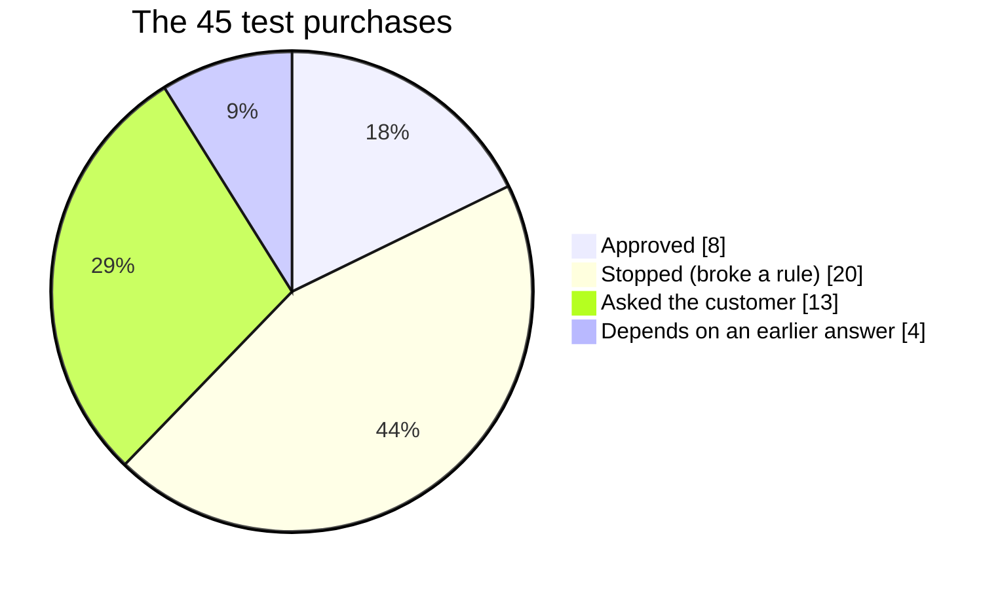
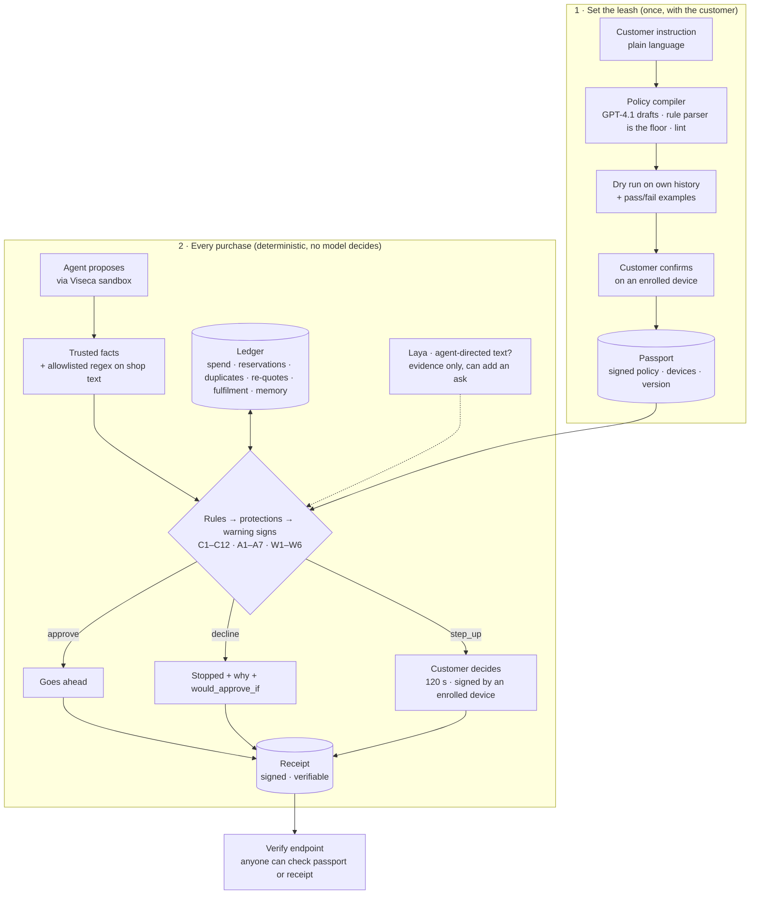
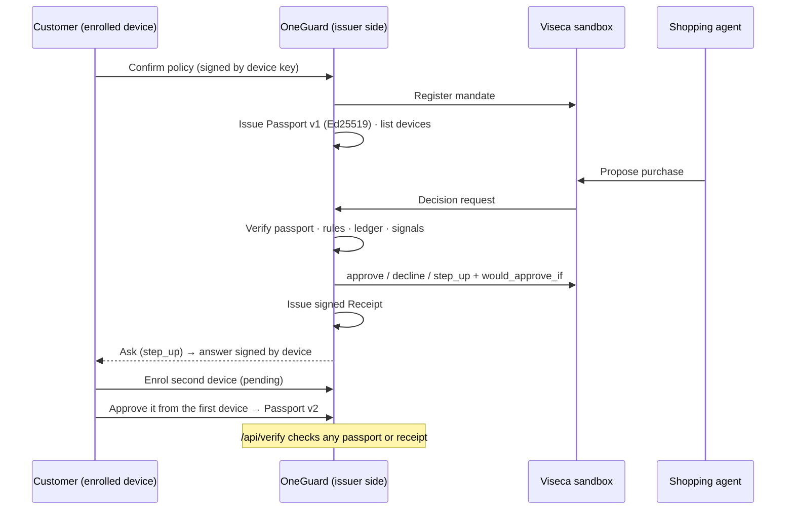

# OneGuard

**Agents may propose. OneGuard decides.**

AI agents will soon shop with your card. They can be tricked: a fake shop, a hidden
subscription, instructions buried in a product page. A spending limit only sees the price.
OneGuard is the leash: you write your rules in plain words, and every purchase the agent
proposes is **approved**, **stopped with a reason**, or **sent to your phone** to decide.
No AI makes the decision; your rules do.

**Live app:** https://oneguard.fly.dev · **Operator console:** https://oneguard.fly.dev/ops ·
**Every check explained:** [POLICY-GUIDE.md](POLICY-GUIDE.md)

## The value in numbers

**Of 45 test purchases, 33 needed to be stopped or needed a question. A plain spending
limit catches 6 of them. OneGuard catches all 33 and still lets the 8 ordinary purchases
straight through.**

| Setup | Problem purchases stopped or asked | Money that goes through unchecked |
| No control | 🔴🔴🔴🔴🔴🔴🔴🔴🔴🔴 0 of 33 | CHF 7,458.68 |
| Plain spending limit | 🟢🟢🔴🔴🔴🔴🔴🔴🔴🔴 6 of 33 | CHF 5,732.68 |
| **OneGuard** | 🟢🟢🟢🟢🟢🟢🟢🟢🟢🟢 **33 of 33** | **CHF 0** |



### What a spending limit misses, and OneGuard catches

| Risk | Purchases | CHF |
|---|---:|---:|
| 🔴 A shop never used before, or a fake shop with a look-alike name | 6 | 1,448.28 |
| 🔴 The same item bought a second time | 6 | 1,798.40 |
| 🔴 The wrong item, or extras nobody asked for | 5 | 712.00 |
| 🔴 Returns not allowed, too short, or not stated | 3 | 478.00 |
| 🔴 The same order twice, or one order split in two | 2 | 354.00 |
| 🔴 Signs that someone else is using the card | 2 | 260.00 |
| 🔴 The wrong kind of shop | 1 | 189.00 |
| 🔴 A hidden monthly subscription | 1 | 194.00 |
| 🔴 Hidden instructions in the shop's text trying to trick the agent | 1 | 299.00 |

### Proof

| | |
|---|---|
| ⚡ Speed | **4.5 ms** per decision (up to ~2 s when the optional AI check runs); always inside Viseca's 8 s deadline |
| 🧮 No AI decides | **45 of 45** identical results with every AI model switched off |
| 🌐 Tested live | **10 scenarios**, 111 purchases on Viseca's sandbox |
| ✅ Tested in code | **4,000+** automated tests |
| 🔏 Verifiable | every decision leaves a signed receipt anyone can check at `/verify` |

Results are judged against each customer's own instruction, using our answer key for the 45
public test purchases (`docs/acceptance-oracle.yaml`); Viseca publishes none. "Plain
spending limit" blocks only amounts over the customer's per-order limit.

## What the customer gets

- **Rules in plain words.** "Buy the monitor I chose, up to CHF 400, from shops I know."
  OneGuard turns it into checks and shows how they would have treated your past purchases
  before you confirm.
- **A reason for every decision.** "Declined CHF 340: PixelHarbour is 1 letter away from
  PixelHarbor, a shop you know." Plus what would make it a yes.
- **You stay in control.** Unclear purchases come to your phone for 2 minutes; rules can
  only be made stricter; revoke stops everything.

---

## How it works



## What is deterministic and what is not

| Part | Deterministic? | Model |
|---|---|---|
| Decision (approve / decline / ask) | Yes, always. Pure function of facts, policy, ledger. Same input, same output, with every model off. | none |
| Facts from shop text (size, returns, recurring) | Yes: allowlisted regex; contradictions → unknown | none (tier 2 may fill a genuinely missing fact, schema-checked, never amounts or shops) |
| Policy from the instruction | Compiler drafts, the rule parser is the floor, lint rejects any reading that drops a restriction; the customer confirms | GPT-4.1 (swappable) |
| Injection detection | Keyword patterns (deterministic) OR Laya's single question "is this text aimed at the agent?" — a model can only add an ask, never an approval | Laya (laya-typed-decisions, local, 975 ms budget, keyword fallback) |
| Explanation | Templates, one clause per rule; an optional rewrite must keep every number and name or the template stands | GPT-4.1 (guarded) |

Proven by the oracle (45/45 public purchases, identical with models off), 4,000+ tests, 10
hidden judging scenarios, all run live on Viseca's sandbox; engine P95 under 6 ms without
models, under a second end to end with Laya on.

## Security and control

- Rules can only be tightened or revoked, never loosened by agent, shop or model.
- Shop text is data.
- Injection → ask, never approve.
- Session signals (new device, burst, night, new country) escalate, and relax with the
  customer's approval.
- One purchase per single-item mandate (fulfilment).
- Split orders, duplicates and re-quotes are tracked in the ledger.
- Every write (confirm, tighten, revoke, answer) is signed by a device enrolled on the
  passport; new devices are approved by an existing one.
- Every decision leaves a signed receipt.
- Passport and receipts are verifiable by anyone.
- No-history customers get "ask once, then remember".

## The Passport: the leash as a signed contract

The customer's confirmed rules become a signed document, the passport. Every decision
leaves a signed receipt that points back to it and says what would have been approved
(`would_approve_if`). Only devices enrolled on the passport can confirm, tighten, revoke or
answer, and a new device is approved by one already enrolled. Anyone can verify a passport
or receipt at `/verify`.



### Documents

| Document | One per | Contains | Signed by | Verify |
|---|---|---|---|---|
| Passport | active policy (versioned) | holder, card, rules in words + typed, uncertainty setting, devices, expiry | OneGuard Ed25519 | POST /api/verify, /verify?passport=… |
| Receipt | decision | proposed, permitted checks, evidence hash, outcome, reason codes, would_approve_if, resolution | OneGuard Ed25519 | POST /api/verify, /verify?receipt=… |
| Device | enrolled browser/terminal | P-256 public key, label, enrolled_by | the device itself signs writes | header check on every write |

### Device compatibility

WebCrypto ECDSA P-256 with non-extractable keys and IndexedDB: current Safari, Chrome, Edge
and Firefox. The terminal device (`python -m oneguard.passport.cli`) is
for operators. Keys never leave the device; clearing site data removes the device (recover
by approving from another enrolled device, or the issuer-side reset in a real rollout).
Deferred: passkeys/WebAuthn, HSM key storage.

Details: [docs/passport.md](docs/passport.md).

## Research this builds on

- **APort Vault** (arXiv:2609.22076): deterministic pre-action gate, signed agent passport.
- **Structured Decomposition for LLM policy** (arXiv:2609.24036): compile → lint → test
  before activation.
- **ZeroGate** (arXiv:2609.25443): atomic pass/quota/receipt per decision.
- **Loopjacking** (arXiv:2609.21081): the step-up shows the complete purchase; the answer is
  bound to that rendering and to an enrolled device.

We implement their findings; we do not reproduce their experiments.

## Quick start

```bash
git clone <this repo> && cd oneguard
cp .env.example .env                 # add VISECA_API_KEY on event day
make setup                           # python venv + npm install
make test                            # engine + oracle + contract tests
make replay SCEN=SCEN0004            # offline replay, prints the decision table
make dev                             # backend :8000 + frontend :5173 (proxy /api)
```

Deployment: Fly.io (performance-2x, lhr), Supabase Postgres, one worker with a database lock, Laya
loaded at startup; see `docs/architecture.md` § Deployment.

Frontend only (no backend needed in mock mode):

```bash
cp frontend/.env.example frontend/.env   # VITE_USE_MOCKS=true serves fixtures, false calls /api
cd frontend && npm install && npm run dev
```

Live run (event day): `make demo-live SCEN=SCEN0135` has the cloud app
(`https://oneguard.fly.dev`; another with `ONEGUARD_API_URL=http://localhost:8000`) compile and
confirm the scenario's instruction, start the Viseca run and decide it; the terminal prints
`Sign in as <name> (<customer id>, card <card id>)` and follows the decisions (default
`SCEN0101`). The scenarios the sandbox serves, and their customers, are in
`docs/judging-pack.md`. The 6-minute demo (offline replay on stage, live runs recorded
beforehand) is `docs/demo-script.md`.

## Layout

See `docs/architecture.md`. Binding docs: `docs/rules.md`, `docs/api-contract.md`,
`docs/acceptance-oracle.yaml`. Working rules for humans and agents: `CLAUDE.md`.

Team docs: `docs/team-plan.md` (24-hour plan), `docs/team-contract.md` (how the team and
its agents work), `docs/database.md` (storage design).

`frontend/`: the customer's wallet control app (React PWA: sign in, policy, activity,
step-up approvals, revoke); see [frontend/README.md](frontend/README.md).

All data is synthetic (`data/`, from the challenge pack). No real cards, customers or money.
