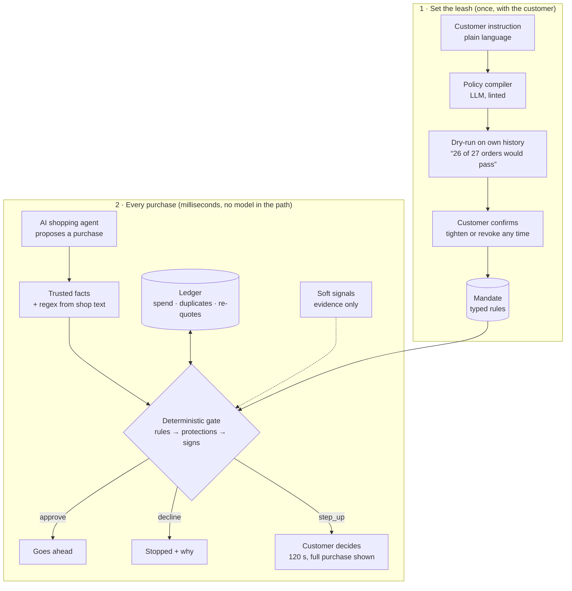

# OneGuard

**Agents may propose. OneGuard decides.**

OneGuard is a wallet control layer for AI shopping agents, built for Viseca's
*Agent on a Leash* challenge at Swiss {ai} Weeks Zurich 2026. A customer describes what
an AI agent may buy on their card; OneGuard turns that into confirmed rules, then decides
every proposed purchase — `approve`, `decline`, or `step_up` (ask the customer) — in
milliseconds, with a plain-language explanation, and without any model in the decision
path.

## How it works



## What it does

- **Policy compiler** — natural language → typed rules → linted → dry-run against the
  customer's own purchase history → customer confirms. Rules can only be tightened after.
- **Deterministic engine** — customer rules, money rules, always-on protections
  (prompt injection, duplicates, split orders, re-quotes, hidden recurring costs,
  lookalike shops) and warning signs (new device, bursts, night, new country), in a fixed
  order. Identical outcomes with every model switched off.
- **Stateful ledger** — rolling limits from final approvals only, pending reservations,
  idempotent redelivery, live-id mapping, reproducible decisions.
- **Customer control** — step-up with a 120 s window that renders the complete purchase,
  revoke, explanations with a counterfactual ("would approve at CHF 400 or less").

## Quick start

```bash
git clone <this repo> && cd oneguard
cp .env.example .env                 # add VISECA_API_KEY on event day
make setup                           # python venv + npm install
make test                            # engine + oracle + contract tests
make replay SCEN=SCEN0004            # offline replay, prints the decision table
make dev                             # backend :8000 + frontend :5173 (proxy /api)
```

Frontend only (no backend needed in mock mode):

```bash
cp frontend/.env.example frontend/.env   # VITE_USE_MOCKS=true serves fixtures, false calls /api
cd frontend && npm install && npm run dev
```

Live run (event day): `make demo-live SCEN=SCEN0002` creates the mandate from the
scenario instruction, starts the Viseca run and streams progress.

## Layout

See `docs/architecture.md`. Binding docs: `docs/rules.md`, `docs/api-contract.md`,
`docs/acceptance-oracle.yaml`. Working rules for humans and agents: `CLAUDE.md`.

`frontend/`: the customer's wallet control app (React PWA: sign in, policy, activity,
step-up approvals, revoke); see [frontend/README.md](frontend/README.md).

## Research this builds on

Deterministic pre-action authorization (APort Vault, arXiv:2609.22076); structured
NL→policy compilation with pre-activation tests (arXiv:2609.24036); atomic pass/quota/
receipt handling for low-latency gates (ZeroGate, arXiv:2609.25443); complete rendering
and use-time binding for human approval (Loopjacking, arXiv:2609.21081). We implement
their findings; we do not reproduce their experiments.

All data is synthetic (`data/`, from the challenge pack). No real cards, customers or money.
