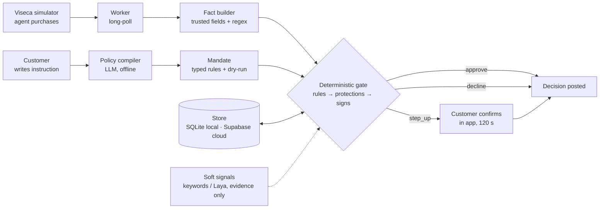

# OneGuard — architecture

Two services, deliberately decoupled (Viseca's stated preference: UI in the "one" app,
engine in the backend under strict latency).



Order inside the gate: customer rules → money rules → protections → uncertainty setting →
warning signs → approve. Signals run in parallel with a 500 ms timeout (`ONEGUARD_SIGNAL_BUDGET_MS`) and can only add
evidence or raise approve → step_up.

`oneguard/llm/` is the one provider interface for generative models (OpenAI first,
Anthropic stub). The policy compiler, tier-2 fact extraction and tier-3 explanation
(rules.md §4a) share it.

## Repo layout

```
oneguard/
  CLAUDE.md  AGENTS.md  README.md  Makefile  .env.example  .gitignore
  docs/
    rules.md                 engine spec (binding)
    api-contract.md          frontend ⇄ backend contract (binding)
    acceptance-oracle.yaml   expected outcomes, test data only
    architecture.md          this file
    demo-script.md           what we show, in order
    decisions.md             running log of choices where spec and data disagreed
  data/                      copy of vendor/viseca-2026/data (synthetic, committed)
  vendor/viseca-2026/        challenge repo clone (read-only reference)
  backend/
    pyproject.toml
    oneguard/
      engine/     facts.py policy.py protections.py warnings.py ledger.py decide.py explain.py signals.py
      compiler/   llm.py parser.py lint.py dryrun.py
      llm/        provider.py openai.py anthropic.py   provider interface: openai first, anthropic stub
      replay/     events.py runner.py oracle.py matrix.py   CSV → live-shaped events; offline replay; replay matrix
      viseca/     client.py worker.py schema.py  sandbox client + long-poll worker
      api/        app.py models.py routes_customer.py routes_dev.py static.py
      store/      db.py schema.py seed.py history.py   SQLAlchemy; SQLite for tests/local, Supabase Postgres in the cloud
    tests/
      test_oracle.py test_engine_*.py test_compiler.py test_api_contract.py test_no_scenario_refs.py
  frontend/                  existing React PWA (see frontend/README.md); additive changes only
```

## Runtime

- `uvicorn oneguard.api.app:app` serves `/api/*` and `frontend/dist` at `/`.
- Worker runs as an asyncio task inside the same process (one team, one key); it never
  blocks on a pending step-up. Poll loop and C8 resolution are independent paths.
- One database per environment via ONEGUARD_DATABASE_URL (docs/database.md). One transaction per decision.
- Viseca key from `VISECA_API_KEY`; base URL from `VISECA_BASE_URL`; both server-side.
- One worker polls per store: the worker lease (docs/database.md §5.1, `store/lease.py`).
  A second process on the same store (a laptop `make serve` next to Fly) stays in `standby` and does not poll, recover step-ups or read the feed;
  it takes over when the holder stops. The sandbox serves each request to whoever polls
  first, so two workers would decide the same team's requests twice (docs/decisions.md).
- Worker (`oneguard/viseca/worker.py`, `VisecaWorker`): on start reads `/v1/bootstrap`
  (`limits`: human window, decision deadline, long-poll cap; `pack_version`) and, in the
  lease holder, runs the reference sync: `/v1/reference-data`. Every
  reference table served under `tables` (a superset of `data/` during judging) is upserted
  into the store in one transaction when its rows differ from the stored ones (count plus
  content hash), never deleting a row, with per-table counts logged (`seed.sync_served`);
  the history index is reloaded in place if anything changed (`ReloadableHistory`: the
  ledger, every run and the API hold the same object). No
  history-file hash is served, so it downloads
  `/v1/reference-data/authorization-history.csv`, and if its SHA-256 differs from
  `data/metadata.json` it re-seeds `authorization_history` and logs it loudly. The served
  `tables.fx_rates` must equal the engine's `facts.FX_TO_CHF` exactly (decimal compare, at
  every sync); a mismatch or a missing table is logged loudly and keeps the worker `ok: false`
  (`/healthz` `degraded`) while it keeps polling; decisions still use `FX_TO_CHF`. The sync runs
  again while polling (lease holder only; concurrent triggers join the one in flight; a
  failure is logged and never blocks a decision): when a bootstrap re-read shows a new
  `pack_version`, when `/v1/reference-data` (read every 5 min) shows another pack version,
  row counts or history file than the last sync, and when an event names a merchant, item,
  customer or card the store does not know. That event waits at most 1 s for the sync (less
  near its deadline), then is decided with what the store has: no catalogue price range,
  merchant category and country from the event, no history (never familiar), plus an
  `info` evidence row `reference_data` naming the ids; an id a finished sync did not bring
  starts no further sync. Every run start (D3 before it creates the run, D8 before it lists
  the catalogue `make demo-live` compiles from, and the first sight of any other run)
  re-reads `/v1/bootstrap` unless it was read in the last 30 s; a changed human window,
  decision deadline or long-poll wait is logged and used from then on. Every request is
  schema-checked (properties the schema does not list are logged and passed on unread; a
  missing required field, a wrong type or an unknown enum value declines with an
  `event_schema` row naming it), stored in `events_raw`, decided by `pipeline.decide_event` within
  `ONEGUARD_ENGINE_BUDGET_MS` and posted before `deadline_at`. A step-up's deadline is the
  reply's `step_up_expires_at` (accepted time + the human window). Until then the platform
  serves the step-up again on every poll (`status: "pending_step_up"`); the worker posts
  nothing for it and pauses briefly. At the deadline the expiry reads the platform's state
  first and posts the timeout `/resolve` (rules Q2) only if it is still pending; at most one
  `/resolve` per live id. After a restart the expiry is re-armed only for pending step-ups
  of live runs (`runs.kind = live`); a replay step-up was never posted to Viseca. Ledger calls run in short `ScopedStoreLedger` sessions.
  All ledger and pipeline calls run on one dedicated thread. The event feed cursor is
  stored in `worker_state` once a page is processed and resumed on start (0 only on first
  boot), so a restart does not re-scan the team-wide feed. The feed is read after each
  decision, on a 204, and at least every 5 s (waiting step-ups keep every poll busy). A
  `scenario.completed` item, a 204, or a start that finds live rows still `running` makes
  the worker read `GET /v1/scenario-runs/{id}` and close each finished run's row (`done`;
  `error` when the platform no longer knows the run). `VisecaWorker.status()` is the
  `/healthz` worker block: `state` (`starting`, `standby`, `polling`, `degraded`,
  `stopped`), `ok` (polling without failures), `last_poll_at`, `events_cursor`,
  `human_window_s`, `pending_step_ups`, `history_reseeded`, `fx_rates_match`,
  `fx_rates_mismatch`, `last_error`, `runs`; every field, `last_error` included, comes from
  the worker's own state. A run's `state` changes in memory before its `runs` row is
  written; `recorded_state` is the committed one, and
  `await VisecaWorker.wait_run_recorded(viseca_run_id)` returns once the final (done/error)
  row has committed. `add_handled_listener` is called with the live id once a delivered
  request is fully handled (decision posted and recorded, `events_raw` and `runs` rows
  committed).
- Viseca call logging is off by default. With `ONEGUARD_LOG_VISECA_CALLS=true` (debugging
  only; unset in `fly.toml`) every call is summarised in `viseca_calls` (no key, bodies
  ≤ 4 KB) by `oneguard/viseca/client.py` (`call_sink`); nothing reads the table to decide or
  to report health, and each call is still logged at DEBUG. `make demo-live SCEN=…` (`oneguard/viseca/demo.py`) starts
  one scenario through the server at `ONEGUARD_API_URL` (default `https://oneguard.fly.dev`; C1,
  C2, D3), prints whom to sign in as and follows the run read-only: the server's worker
  decides. `make demo-offline SCEN=…` restarts that server's offline replay (D2). Both probe
  `/healthz` first; with no OneGuard server answering they exit 1 and start nothing: no run,
  no replay, never a worker of their own.

## Deployment (Plan C)

One container on Fly (`https://oneguard.fly.dev`), app `oneguard`.

- `Dockerfile`: a node stage builds `frontend/dist` (only when `frontend/package.json` is in
  the context) with `VITE_API_BASE_URL=/api` and `VITE_USE_MOCKS=false`; the runtime stage is
  `python:3.12-slim` + `tzdata` (Europe/Zurich rules), the backend installed editable with
  its `compiler` extra (the OpenAI and Anthropic SDKs) and its `signals` extra (Laya) on the
  CPU-only torch wheel from the PyTorch index; the `laya-typed-decisions` checkpoint is
  downloaded and loaded once at build time into `HF_HOME=/opt/huggingface`, and
  `HF_HUB_OFFLINE=1` keeps the machine off the Hub. `data/` beside it, `backend/scripts`
  (for `bench_engine.py --laya` on the machine) and `frontend/dist` copied in, run as a
  non-root user; `uvicorn oneguard.api.app:app` listens on `$PORT` (8080);
  `ONEGUARD_SOFT_SIGNALS=laya` and `ONEGUARD_ENV=prod` are the image defaults.
- `fly.toml`: region `lhr` (nearest Supabase in eu-west-1), one `performance-2x` machine with
  4 GB (Laya on CPU; dedicated CPUs because shared ones throttle, docs/benchmark.md §3), never auto-stopped (the
  worker polls from inside the app), no volume: state lives in Supabase via
  `ONEGUARD_DATABASE_URL`. Health check `GET /healthz`, 120 s grace. Deploy strategy
  `immediate`: with one machine a rolling deploy only waits on the health check, and the
  new machine polls as soon as the app is up (the model loads in the background).
- Fly secrets: `VISECA_API_KEY`, `OPENAI_API_KEY`, `ONEGUARD_DATABASE_URL`,
  `ONEGUARD_LLM_PROVIDER`; temporarily `ONEGUARD_ALLOW_RUNS=false`
  (D3 and `make demo-live` refuse to start a run while it is set). Set with `fly secrets`, never in files.
  `ONEGUARD_SOFT_SIGNALS` is not a secret: the image default (`laya`) applies; a secret of that
  name would override it (`keywords` turns the model off without a rebuild).
- Rollback: every deploy is tagged in `registry.fly.io/oneguard`; `fly image show -a oneguard`
  before a deploy names the running one, and `fly deploy -a oneguard --image <that ref>` puts
  it back.
- Makefile: `make deploy` (`fly deploy -a oneguard --ha=false`), `make logs`, `make image`
  (the same image locally), `make demo-live SCEN=…`, `make demo-offline`, `make seed`,
  `make reset-db` (refused when `ONEGUARD_ENV=prod`), `make matrix` (regenerates
  `docs/replay-matrix.md`; `tests/test_replay_matrix.py` fails when it is stale).
- App start (`oneguard/api/app.py` lifespan): `init_db` (creates missing tables, never drops),
  seeds only an empty store, loads `HistoryIndex`, warms the pool (5 connections), then starts
  the worker in the background only when `VISECA_API_KEY` is set, after binding every
  stored mandate's policy to it. With `ONEGUARD_SOFT_SIGNALS=laya` the model loads in a
  background thread at the same time (about 35 s on the machine): the worker polls and
  decides with keywords meanwhile, and `signals.LayaSignals` switches to the model the
  moment it is loaded. A failed load keeps keywords and is logged.
- `/healthz` (never names a secret or URL): `status` (`ok` when the database answers and the
  worker, if configured, is `ok`: polling without errors and the served fx rates equal
  `FX_TO_CHF`), `worker` (`VisecaWorker.status()`: state, polling, last poll, events
  cursor, human window, pending step-ups, fx rates match and mismatch lines, last error), `events_cursor`,
  `provider` (name, configured), `signals` (`backend`: the detector answering now, `keywords`
  until the model has loaded; `configured`; `enabled`; `model_loading`; `model_loaded`), `database`
  (engine name `sqlite`/`postgresql`, `SELECT 1` round trip in ms), `engine.stubbed`.
  503 only when the database does not answer.
- SQLite fallback (docs/database.md §5): if Supabase is unreachable, unset
  `ONEGUARD_DATABASE_URL`; the app seeds the empty SQLite store on the machine at start.

## Dependencies (ask before adding)

Python 3.12 · fastapi · uvicorn · pydantic v2 · httpx · sqlalchemy · psycopg[binary] · jsonschema ·
pyyaml · pandas (replay/ and store/seed.py only) · pytest · ruff · optional: openai, anthropic (compiler; `oneguard/llm/`), laya==0.3.20 (signals:
agent_directed only; ~850 MB checkpoint cached outside the repo, baked into the image; ~5 s first load, keep warm).

## Latency budget per decision

Fact build < 5 ms · rules + protections + signs < 5 ms · ledger transaction < 10 ms ·
signals ≤ 500 ms (parallel, optional; `ONEGUARD_SIGNAL_BUDGET_MS`) · tier 2 ≤ 1.5 s (only when a rule is `unknown`),
inside the 2 s budget · Viseca POST ~100–300 ms. Internal budget 2 s; platform deadline
8 s from queueing. Tier 3 runs after posting, not in the budget.
Measured (docs/benchmark.md, `backend/scripts/bench_engine.py`): end-to-end P95 5.6 ms on
SQLite with signals off; Laya agent_directed P95 99 ms per purchase on the laptop.
