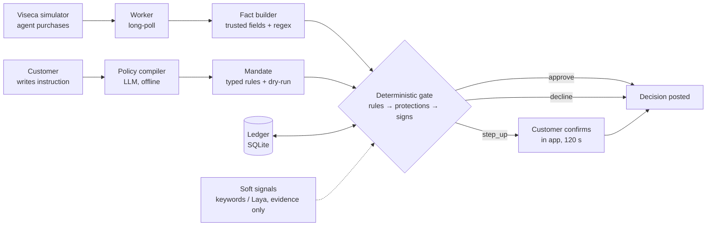

# OneGuard — architecture

Two services, deliberately decoupled (Viseca's stated preference: UI in the "one" app,
engine in the backend under strict latency).



Order inside the gate: customer rules → money rules → protections → uncertainty setting →
warning signs → approve. Signals run in parallel with a 500 ms timeout and can only add
evidence or raise approve → step_up.

## Repo layout

```
oneguard/
  CLAUDE.md  AGENTS.md  README.md  Makefile  .env.example  .gitignore
  docs/
    rules.md                 engine spec (binding)
    api-contract.md          frontend ⇄ backend contract (binding)
    acceptance-oracle.yaml   expected outcomes, test data only
    architecture.md          this file
    demo-script.md           what we show, in order
    decisions.md             running log of choices where spec and data disagreed
  data/                      copy of vendor/viseca-2026/data (synthetic, committed)
  vendor/viseca-2026/        challenge repo clone (read-only reference)
  backend/
    pyproject.toml
    oneguard/
      engine/     facts.py policy.py protections.py warnings.py ledger.py decide.py explain.py signals.py
      compiler/   llm.py parser.py lint.py dryrun.py
      replay/     events.py runner.py            CSV → live-shaped events; offline replay
      viseca/     client.py worker.py schema.py  sandbox client + long-poll worker
      api/        app.py models.py routes_customer.py routes_dev.py static.py
      store/      db.py                          SQLite schema, migrations
    tests/
      test_oracle.py test_engine_*.py test_compiler.py test_api_contract.py test_no_scenario_refs.py
  frontend/                  existing React PWA (see frontend/README.md); additive changes only
```

## Runtime

- `uvicorn oneguard.api.app:app` serves `/api/*` and `frontend/dist` at `/`.
- Worker runs as an asyncio task inside the same process (one team, one key); it never
  blocks on a pending step-up. Poll loop and C8 resolution are independent paths.
- SQLite file per environment (`ONEGUARD_DB`). One transaction per decision.
- Viseca key from `VISECA_API_KEY`; base URL from `VISECA_BASE_URL`; both server-side.

## Dependencies (ask before adding)

Python 3.12 · fastapi · uvicorn · pydantic v2 · httpx · jsonschema · pyyaml · pandas (replay
and dry-run only) · pytest · ruff · optional: anthropic (compiler), laya==0.3.20 (signals:
agent_directed only; ~850 MB checkpoint cached outside the repo; ~5 s first load, keep warm).

## Latency budget per decision

Fact build < 5 ms · rules + protections + signs < 5 ms · ledger transaction < 10 ms ·
signals ≤ 500 ms (parallel, optional) · Viseca POST ~100–300 ms. Internal budget 2 s;
platform deadline 8 s from queueing.
