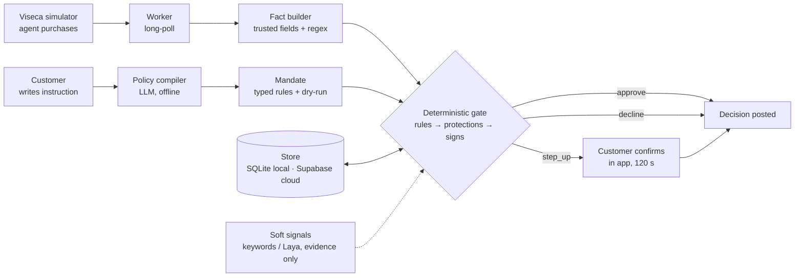

# OneGuard — architecture

Two services, deliberately decoupled (Viseca's stated preference: UI in the "one" app,
engine in the backend under strict latency).



Order inside the gate: customer rules → money rules → protections → uncertainty setting →
warning signs → approve. Signals run in parallel with a 500 ms timeout and can only add
evidence or raise approve → step_up.

`oneguard/llm/` is the one provider interface for generative models (OpenAI first,
Anthropic stub). The policy compiler, tier-2 fact extraction and tier-3 explanation
(rules.md §4a) share it.

## Repo layout

```
oneguard/
  CLAUDE.md  AGENTS.md  README.md  Makefile  .env.example  .gitignore
  docs/
    rules.md                 engine spec (binding)
    api-contract.md          frontend ⇄ backend contract (binding)
    acceptance-oracle.yaml   expected outcomes, test data only
    architecture.md          this file
    demo-script.md           what we show, in order
    decisions.md             running log of choices where spec and data disagreed
  data/                      copy of vendor/viseca-2026/data (synthetic, committed)
  vendor/viseca-2026/        challenge repo clone (read-only reference)
  backend/
    pyproject.toml
    oneguard/
      engine/     facts.py policy.py protections.py warnings.py ledger.py decide.py explain.py signals.py
      compiler/   llm.py parser.py lint.py dryrun.py
      llm/        provider.py openai.py anthropic.py   provider interface: openai first, anthropic stub
      replay/     events.py runner.py            CSV → live-shaped events; offline replay
      viseca/     client.py worker.py schema.py  sandbox client + long-poll worker
      api/        app.py models.py routes_customer.py routes_dev.py static.py
      store/      db.py schema.py seed.py history.py   SQLAlchemy; SQLite for tests/local, Supabase Postgres in the cloud
    tests/
      test_oracle.py test_engine_*.py test_compiler.py test_api_contract.py test_no_scenario_refs.py
  frontend/                  existing React PWA (see frontend/README.md); additive changes only
```

## Runtime

- `uvicorn oneguard.api.app:app` serves `/api/*` and `frontend/dist` at `/`.
- Worker runs as an asyncio task inside the same process (one team, one key); it never
  blocks on a pending step-up. Poll loop and C8 resolution are independent paths.
- One database per environment via ONEGUARD_DATABASE_URL (docs/database.md). One transaction per decision.
- Viseca key from `VISECA_API_KEY`; base URL from `VISECA_BASE_URL`; both server-side.
- Worker (`oneguard/viseca/worker.py`, `VisecaWorker`): on start reads `/v1/bootstrap`
  (human window, decision deadline) and `/v1/reference-data`; if the served history-file
  SHA-256 differs from `data/metadata.json` it re-seeds `authorization_history` from
  `/v1/reference-data/authorization-history.csv` and logs it loudly. The served
  `tables.fx_rates` must equal the engine's `facts.FX_TO_CHF` exactly (decimal compare); a
  mismatch or a missing table is logged loudly and keeps the worker `degraded` (`ok: false`)
  for as long as it runs; decisions still use `FX_TO_CHF`. Every request is
  schema-checked, stored in `events_raw`, decided by `pipeline.decide_event` within
  `ONEGUARD_ENGINE_BUDGET_MS` and posted before `deadline_at`. A step-up's deadline is the
  accepted time + the human window; an expiry task posts the timeout `/resolve` (rules Q2).
  All ledger and pipeline calls run on one dedicated thread. `VisecaWorker.status()` is the
  `/healthz` worker block: `state`, `ok`, `last_poll_at`, `events_cursor`,
  `human_window_s`, `pending_step_ups`, `history_reseeded`, `fx_rates_match`,
  `fx_rates_mismatch`, `last_error`, `runs`.
- Every Viseca call is summarised in `viseca_calls` (no key, bodies ≤ 4 KB) by
  `oneguard/viseca/client.py`. `make demo-live SCEN=…` runs one scenario end to end
  (`oneguard/viseca/demo.py`); it needs `VISECA_API_KEY`.

## Deployment (Plan C)

One container on Fly, built by P1-2 (docs/team-plan.md). The files below arrive with that
code; this section is the target they are built to.

- `Dockerfile`: a node build stage builds `frontend/dist`; the runtime stage is
  `python:3.12-slim` with the backend installed and `frontend/dist` copied in; `uvicorn`
  listens on `$PORT`; `ONEGUARD_SOFT_SIGNALS=keywords` is the image default.
- python:3.12-slim needs the tzdata package for Europe/Zurich rules
- `fly.toml`: region `lhr`, one machine, no volume (state lives in Supabase via
  `ONEGUARD_DATABASE_URL`).
- Fly secrets: `VISECA_API_KEY`, `OPENAI_API_KEY`, `ONEGUARD_DATABASE_URL`.
- Makefile targets: `make deploy`, `make demo-live SCEN=…`, `make demo-offline`,
  `make matrix` (45-row replay matrix), `make seed`, `make reset-db` (guarded by
  `ONEGUARD_ENV != prod`). `demo-live` and `demo-offline` exist today; the others are added
  with the Wave 1–2 code (P1-0 `seed` / `reset-db`, P1-2 `deploy`, P5-4 `matrix`).
- `/healthz` reports worker polling, provider configured, signals backend, database engine
  (sqlite/postgres), a 1-row round-trip time, and the `GET /v1/events` cursor position;
  the `viseca_calls` table (docs/database.md §2) feeds it.
- SQLite fallback (docs/database.md §5): if Supabase is unreachable, unset
  `ONEGUARD_DATABASE_URL` → SQLite on the Fly machine, `make seed`, restart.

## Dependencies (ask before adding)

Python 3.12 · fastapi · uvicorn · pydantic v2 · httpx · sqlalchemy · psycopg[binary] · jsonschema ·
pyyaml · pandas (replay/ and store/seed.py only) · pytest · ruff · optional: openai, anthropic (compiler; `oneguard/llm/`), laya==0.3.20 (signals:
agent_directed only; ~850 MB checkpoint cached outside the repo; ~5 s first load, keep warm).

## Latency budget per decision

Fact build < 5 ms · rules + protections + signs < 5 ms · ledger transaction < 10 ms ·
signals ≤ 500 ms (parallel, optional) · tier 2 ≤ 1.5 s (only when a rule is `unknown`),
inside the 2 s budget · Viseca POST ~100–300 ms. Internal budget 2 s; platform deadline
8 s from queueing. Tier 3 runs after posting, not in the budget.
