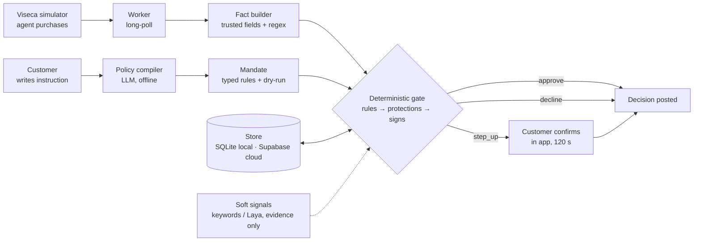

# OneGuard — architecture

Two services, deliberately decoupled (Viseca's stated preference: UI in the "one" app,
engine in the backend under strict latency).



Order inside the gate: customer rules → money rules → protections → uncertainty setting →
warning signs → approve. Signals run in parallel with a 500 ms timeout and can only add
evidence or raise approve → step_up.

`oneguard/llm/` is the one provider interface for generative models (OpenAI first,
Anthropic stub). The policy compiler, tier-2 fact extraction and tier-3 explanation
(rules.md §4a) share it.

## Repo layout

```
oneguard/
  CLAUDE.md  AGENTS.md  README.md  Makefile  .env.example  .gitignore
  docs/
    rules.md                 engine spec (binding)
    api-contract.md          frontend ⇄ backend contract (binding)
    acceptance-oracle.yaml   expected outcomes, test data only
    architecture.md          this file
    demo-script.md           what we show, in order
    decisions.md             running log of choices where spec and data disagreed
  data/                      copy of vendor/viseca-2026/data (synthetic, committed)
  vendor/viseca-2026/        challenge repo clone (read-only reference)
  backend/
    pyproject.toml
    oneguard/
      engine/     facts.py policy.py protections.py warnings.py ledger.py decide.py explain.py signals.py
      compiler/   llm.py parser.py lint.py dryrun.py
      llm/        provider.py openai.py anthropic.py   provider interface: openai first, anthropic stub
      replay/     events.py runner.py            CSV → live-shaped events; offline replay
      viseca/     client.py worker.py schema.py  sandbox client + long-poll worker
      api/        app.py models.py routes_customer.py routes_dev.py static.py
      store/      db.py schema.py seed.py history.py   SQLAlchemy; SQLite for tests/local, Supabase Postgres in the cloud
    tests/
      test_oracle.py test_engine_*.py test_compiler.py test_api_contract.py test_no_scenario_refs.py
  frontend/                  existing React PWA (see frontend/README.md); additive changes only
```

## Runtime

- `uvicorn oneguard.api.app:app` serves `/api/*` and `frontend/dist` at `/`.
- Worker runs as an asyncio task inside the same process (one team, one key); it never
  blocks on a pending step-up. Poll loop and C8 resolution are independent paths.
- One database per environment via ONEGUARD_DATABASE_URL (docs/database.md). One transaction per decision.
- Viseca key from `VISECA_API_KEY`; base URL from `VISECA_BASE_URL`; both server-side.
- Worker (`oneguard/viseca/worker.py`, `VisecaWorker`): on start reads `/v1/bootstrap`
  (`limits`: human window, decision deadline, long-poll cap) and `/v1/reference-data`. Every
  reference table served under `tables` (a superset of `data/` during judging) is upserted
  into the store in one transaction when its rows differ from the stored ones (count plus
  content hash), never deleting a row, with per-table counts logged (`seed.sync_served`);
  the history index is reloaded if anything changed. No
  history-file hash is served, so it downloads
  `/v1/reference-data/authorization-history.csv`, and if its SHA-256 differs from
  `data/metadata.json` it re-seeds `authorization_history` and logs it loudly. Every request is
  schema-checked, stored in `events_raw`, decided by `pipeline.decide_event` within
  `ONEGUARD_ENGINE_BUDGET_MS` and posted before `deadline_at`. A step-up's deadline is the
  reply's `step_up_expires_at` (accepted time + the human window). Until then the platform
  serves the step-up again on every poll (`status: "pending_step_up"`); the worker posts
  nothing for it and pauses briefly. At the deadline the expiry reads the platform's state
  first and posts the timeout `/resolve` (rules Q2) only if it is still pending; at most one
  `/resolve` per live id. Ledger calls run in short `ScopedStoreLedger` sessions.
  All ledger and pipeline calls run on one dedicated thread. The event feed cursor is
  stored in `worker_state` once a page is processed and resumed on start (0 only on first
  boot), so a restart does not re-scan the team-wide feed. `VisecaWorker.status()` is the
  `/healthz` worker block: `state`, `ok`, `last_poll_at`, `events_cursor`,
  `human_window_s`, `pending_step_ups`, `history_reseeded`, `last_error`, `runs`.
- Every Viseca call is summarised in `viseca_calls` (no key, bodies ≤ 4 KB) by
  `oneguard/viseca/client.py`. `make demo-live SCEN=…` runs one scenario end to end
  (`oneguard/viseca/demo.py`); it needs `VISECA_API_KEY`.

## Deployment (Plan C)

One container on Fly (`https://oneguard.fly.dev`), app `oneguard`.

- `Dockerfile`: a node stage builds `frontend/dist` (only when `frontend/package.json` is in
  the context) with `VITE_API_BASE_URL=/api` and `VITE_USE_MOCKS=false`; the runtime stage is
  `python:3.12-slim` + `tzdata` (Europe/Zurich rules), the backend installed editable with
  its `compiler` extra (the OpenAI and Anthropic SDKs; the `signals` extra, Laya, stays out)
  and `data/` beside it and `frontend/dist` copied in, run as a non-root user; `uvicorn
  oneguard.api.app:app` listens on `$PORT` (8080); `ONEGUARD_SOFT_SIGNALS=keywords` and
  `ONEGUARD_ENV=prod` are the image defaults.
- `fly.toml`: region `lhr` (nearest Supabase in eu-west-1), one `shared-cpu-1x` machine with
  1 GB, never auto-stopped (the worker polls from inside the app), no volume: state lives in
  Supabase via `ONEGUARD_DATABASE_URL`. Health check `GET /healthz`, 60 s grace.
- Fly secrets: `VISECA_API_KEY`, `OPENAI_API_KEY`, `ONEGUARD_DATABASE_URL`,
  `ONEGUARD_LLM_PROVIDER`, `ONEGUARD_SOFT_SIGNALS`; temporarily `ONEGUARD_ALLOW_RUNS=false`
  (D3 and `make demo-live` refuse to start a run while it is set). Set with `fly secrets`, never in files.
- Makefile: `make deploy` (`fly deploy -a oneguard --ha=false`), `make logs`, `make image`
  (the same image locally), `make demo-live SCEN=…`, `make demo-offline`, `make seed`,
  `make reset-db` (refused when `ONEGUARD_ENV=prod`); `make matrix` arrives with P5-4.
- App start (`oneguard/api/app.py` lifespan): `init_db` (creates missing tables, never drops),
  seeds only an empty store, loads `HistoryIndex`, warms the pool (5 connections), warms
  soft signals if enabled, then starts the worker in the background only when
  `VISECA_API_KEY` is set, after binding every stored mandate's policy to it.
- `/healthz` (never names a secret or URL): `status` (`ok` when the database answers and the
  worker, if configured, is polling), `worker` (`VisecaWorker.status()`: state, polling,
  last poll, events cursor, human window, pending step-ups, last error), `events_cursor`,
  `provider` (name, configured), `signals` (backend, enabled, model loaded), `database`
  (engine name `sqlite`/`postgresql`, `SELECT 1` round trip in ms), `engine.stubbed`.
  503 only when the database does not answer.
- SQLite fallback (docs/database.md §5): if Supabase is unreachable, unset
  `ONEGUARD_DATABASE_URL`; the app seeds the empty SQLite store on the machine at start.

## Dependencies (ask before adding)

Python 3.12 · fastapi · uvicorn · pydantic v2 · httpx · sqlalchemy · psycopg[binary] · jsonschema ·
pyyaml · pandas (replay/ and store/seed.py only) · pytest · ruff · optional: openai, anthropic (compiler; `oneguard/llm/`), laya==0.3.20 (signals:
agent_directed only; ~850 MB checkpoint cached outside the repo; ~5 s first load, keep warm).

## Latency budget per decision

Fact build < 5 ms · rules + protections + signs < 5 ms · ledger transaction < 10 ms ·
signals ≤ 500 ms (parallel, optional) · tier 2 ≤ 1.5 s (only when a rule is `unknown`),
inside the 2 s budget · Viseca POST ~100–300 ms. Internal budget 2 s; platform deadline
8 s from queueing. Tier 3 runs after posting, not in the budget.
Measured (docs/benchmark.md, `backend/scripts/bench_engine.py`): end-to-end P95 5.6 ms on
SQLite with signals off; Laya agent_directed P95 99 ms per purchase on the laptop.

Tier 3 is a background task the worker starts once a decision is posted (only while the
run has a provider; D5 off clears it): the model call runs on tier-3 threads, off the engine
thread, with an 8 s timeout, then one short ledger session stores the new message with
`explanation_source: model`. The poll loop never waits for it.
