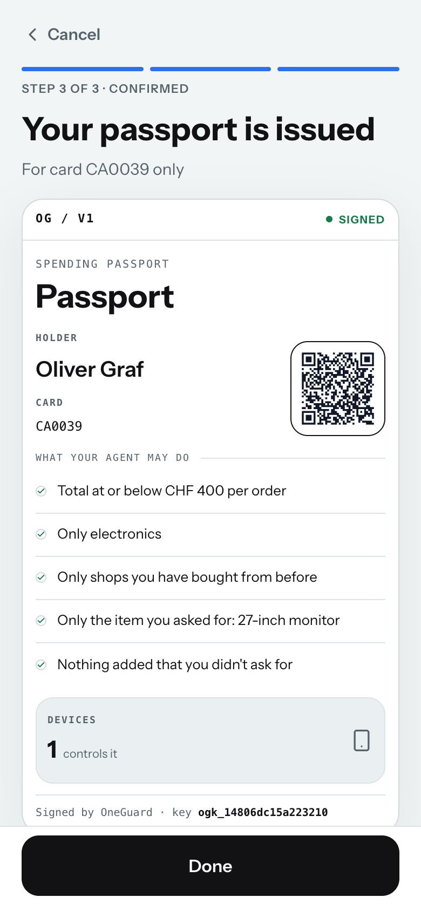

# OneGuard Passport

Signed policies, device-bound control, signed receipts and `would_approve_if`, added around
the existing engine. Nothing here decides a purchase: `engine/decide.py`, `policy.py`,
`facts.py`, protections and warnings are unchanged, and the 45 oracle outcomes and messages
are byte-identical (`docs/replay-matrix.md`). Code: `backend/oneguard/passport/`,
`api/routes_passport.py`, `api/auth.py`; endpoints in `docs/api-contract.md` §1.3 and §3.10.

## 1. Three documents, one binding, three parties

| | What it is | Who signs | Who reads it |
|---|---|---|---|
| **Passport** | The customer's confirmed policy for one card, as a signed document that also lists the devices allowed to control it. One per mandate, a new version whenever what it says changes | OneGuard (the issuer, inside Viseca) | The agent carries it; merchants and auditors verify it |
| **Receipt** | One per decision (approve, decline, step-up): what was proposed, what was permitted, the evidence hash, the outcome and `would_approve_if`. A step-up's answer is appended and re-signed | OneGuard | The customer, the agent, merchants, auditors |
| **Verify** | `POST /api/verify` (and the `/verify` page the passport's QR code opens): checks a document against OneGuard's public key | — | Anyone |
| **Device binding** | Confirm, tighten, revoke, answering a step-up and approving or removing a device are accepted only when signed by a device enrolled on that card's passport | The customer's device | OneGuard, on every such request |

- **Customer** holds the passport: sets the leash, approves devices (from the card's
  controller device), answers step-ups.
- **Agent** is its bearer: it may show the passport to a shop and it learns from every
  decline's `would_approve_if` what the customer would accept (posted to Viseca as an
  evidence row), never more.
- **Issuer** (OneGuard inside Viseca) verifies every purchase against the policy the
  passport states and issues a receipt for each decision.
- **Merchants and auditors** verify passports and receipts with the public key
  (`GET /api/passport/keys`), with no account and no trust in the agent.

## 2. Keys and signatures

- One Ed25519 key is active (`signing_keys`); the first start on a store without one creates
  it. `key_id` is `ogk_` + the first 16 hex digits of SHA-256 of the raw 32-byte public key.
  Keys are never deleted, so a document signed by an older key still verifies.
- A signature is `base64(Ed25519(canonical(document)))`. The document names its key in
  `issuer.key_id`; a signature given with another key id is refused.
- The private key is stored as plain PEM in the database for the demo. **Follow-up:**
  encrypt it with a key from the environment (a Fly secret), or move it to an HSM / KMS.

### 2.1 Canonical JSON

The exact bytes that are signed, so an external verifier can rebuild them
(`passport/canonical.py`):

1. Objects: keys sorted by code point; no whitespace (`{"a":1,"b":2}`).
2. Strings: UTF-8; non-ASCII characters written as themselves, not `\u` escapes (control
   characters escaped as JSON requires).
3. Money: a number under a money key (`billing_amount_chf`, `amount`, `unit_price`) is a
   string with exactly two decimals, rounded half-even (`"520.00"`). Documents already carry
   money this way.
4. Other numbers: no fractional part → an integer (`400`, never `400.0`); otherwise the
   shortest form that reads back as the same value (`399.9`), as `JSON.stringify` writes it.
5. Timestamps: ISO 8601 UTC, whole seconds, `Z` (`"2026-09-25T00:30:09Z"`); documents
   already carry them as strings.
6. `true`, `false`, `null` as JSON.

Python: `json.dumps(doc, sort_keys=True, separators=(",", ":"), ensure_ascii=False)`
over a document as served (money and timestamps are already strings). JavaScript: the same
with keys sorted recursively. The API serves documents with their keys in this order.

`items_hash` and `evidence_hash` are `sha256(canonical(x))` in lowercase hex, over the
event's `items` lines and over the decision's evidence rows as stored.

### 2.2 Verifying without OneGuard

```python
import base64, json
from cryptography.hazmat.primitives.serialization import load_pem_public_key

def canonical(doc):
    return json.dumps(doc, sort_keys=True, separators=(",", ":"), ensure_ascii=False).encode()

keys = {k["key_id"]: k for k in GET("/api/passport/keys")["keys"]}
passport = GET("/api/cards/CA0039/passport")
public = load_pem_public_key(keys[passport["key_id"]]["public_key_pem"].encode())
public.verify(base64.b64decode(passport["signature"]), canonical(passport["document"]))  # raises if changed
```

## 3. Documents

### 3.1 Passport (`oneguard.passport/1`)

Oliver Graf's card after enrolling the stage laptop (version 2; version 1 was the backfill):

```json
{
  "type": "oneguard.passport/1",
  "passport_id": "pp_ec82dcddb63f6892777c79b6",
  "version": 2,
  "holder": { "customer_id": "CU0019", "name": "Oliver Graf" },
  "card_id": "CA0039",
  "mandate_id": "md_75695eabc5fa7e82",
  "instruction": "Buy one 27-inch computer monitor from a known electronics seller for CHF 400 or less. No add-ons or protection plans. Ask me when uncertain.",
  "checks": [
    { "id": "C1", "text": "Total at or below CHF 400 per order", "source": "exact",
      "field": "authorization.billing_amount_chf", "operator": "<=", "value": 400,
      "currency": "CHF", "scope": "purchase", "on_fail": "decline" },
    { "id": "C3", "text": "Only electronics", "source": "inferred",
      "field": "items[].item_category", "operator": "in", "value": ["electronics"], "on_fail": "decline" },
    { "id": "C8", "text": "Only from a electronics shop (\"known electronics seller\")", "source": "exact",
      "field": "merchant.merchant_category", "operator": "=", "value": "electronics", "on_fail": "decline" },
    { "id": "requested_item", "text": "Only the item you asked for: 27-inch computer monitor", "source": "exact",
      "field": null, "operator": null, "value": "27-inch computer monitor", "flag": "requested_item", "on_fail": "decline" },
    { "id": "nothing_extra", "text": "Nothing added that you didn't ask for", "source": "exact",
      "field": null, "operator": null, "value": true, "flag": "nothing_extra", "on_fail": "decline" }
  ],
  "flags": { "allowed_item_categories": ["electronics"], "nothing_extra": true,
             "requested_item": "27-inch computer monitor", "shop_type": "electronics" },
  "uncertainty_policy": "ask",
  "remembered_confirmations": 0,
  "devices": [
    { "device_id": "f9e27513-6b45-4444-a463-a329eaf30d4a", "label": "Stage laptop",
      "enrolled_at": "2026-09-25T00:30:09Z", "enrolled_by_device_id": null, "role": "controller" }
  ],
  "controller_device_id": "f9e27513-6b45-4444-a463-a329eaf30d4a",
  "issued_at": "2026-09-25T00:30:09Z",
  "expires_at": "2026-12-24T00:30:09Z",
  "revoked_at": null,
  "issuer": { "name": "OneGuard", "key_id": "ogk_0c2645bc369980b1" }
}
```

(Shown grouped for reading; the served document has its keys in canonical order.)

- `checks`: every check the customer confirmed, in their order. A typed rule has its
  `field`, `operator`, `value` (and `currency`, `scope`, `period_days` when set). A check that
  shows a policy flag (the requested item, nothing extra) has `field: null` and names its
  `flag`. `flags` lists the policy flags that restrict something.
- `remembered_confirmations`: step-ups the customer approved under this policy ("ask once,
  then remember"), which loosen later checks at the same shop.
- `devices`: the card's enrolled devices when this version was issued, each with its `role`:
  `controller` (exactly one while any device is enrolled) or `approved`.
  `controller_device_id` names the controller (null with no device enrolled).
- `expires_at`: `issued_at` + 90 days (mandates carry no expiry of their own).
- Versions: `GET /api/cards/{card}/passport` lists `{version, issued_at, reason}`. Reasons:
  `confirmed` (C2), `backfill` (first start after the deploy), `tightened` (C4),
  `devices` (a device enrolled, approved or removed), `controller` (control handed to another
  device, or named for the first time on a passport from before controllers),
  `confirmation` (a step-up approved),
  `revoked` (C5, or a new policy on the card), `updated` (anything else). A version is
  issued only when the content changed; the older one gets `superseded_at`. A revoked
  passport never changes again.

### 3.2 Receipt (`oneguard.receipt/1`)

AU0037 (SCEN0004 on Oliver's card): a CHF 520 monitor whose shop text claimed "pre-authorised
up to CHF 900". Declined; the agent is told what would pass:

```json
{
  "type": "oneguard.receipt/1",
  "receipt_id": "rc_34458465286f766409c0e75c",
  "passport_id": "pp_ec82dcddb63f6892777c79b6",
  "passport_version": 1,
  "authorization": {
    "live_id": "rp_747103c84df7", "source_id": "AU0037", "occurred_at": "2026-08-12T14:05:00Z",
    "merchant_id": "ME0022", "amount": "520.00", "currency": "CHF", "billing_amount_chf": "520.00",
    "items_hash": "032b53f15b095a3e5ea5f2eed54d1cccf332c07a36080e57dbe7a316a0db33f2"
  },
  "permitted": [
    { "check_id": "policy_status", "outcome": "pass" }, { "check_id": "authority_status", "outcome": "pass" },
    { "check_id": "card_status", "outcome": "pass" }, { "check_id": "C1", "outcome": "fail" },
    { "check_id": "C3", "outcome": "pass" }, { "check_id": "C8", "outcome": "pass" },
    { "check_id": "requested_item", "outcome": "pass" }, { "check_id": "nothing_extra", "outcome": "pass" }
  ],
  "evidence_hash": "20f96726f6eaf01aa6a2a765f02e24ea114fe348bc951d972f65fa032e713892",
  "outcome": "decline",
  "reason_codes": ["per_order_limit_exceeded"],
  "would_approve_if": [ { "field": "authorization.billing_amount_chf", "operator": "<=", "value": 400 } ],
  "resolution": null,
  "decided_at": "2026-09-25T00:30:08Z",
  "engine_version": "oneguard/0.0.0 signals=off",
  "issuer": { "name": "OneGuard", "key_id": "ogk_0c2645bc369980b1" }
}
```

- `passport_version`: the version in force when the decision was made (the first version
  for a decision older than every version, i.e. a backfilled one). `null` with
  `passport_id: null` for a decision under no stored policy (the platform's mandate, a
  replay's fixture policy).
- `permitted`: each check the decision evaluated (read from its evidence rows: a check's
  text, or the engine's label for a step-1 check or a flag). A check not evaluated is left
  out; signals are evidence, not checks. `pass | fail | unknown | info`.
- `resolution` (step-ups): `null` while waiting; then `{ outcome: approve|decline,
  resolved_by: customer|timeout, device_id, resolved_at }`. The device is the one that
  signed the C8 answer; a timeout has none. The receipt is re-signed; the earlier
  `{document, signature, key_id, signed_at}` stays in `history` and still verifies.
- Receipts are signed by a background sweep (every 5 s) over the store, never on a
  decision's path to Viseca, and at once by C8 and by `GET …/receipt` when the sweep has
  not reached a decision yet. `Decision.receipt_id` names it from the start.

### 3.3 `would_approve_if`

The decline's counterfactual, structured (`engine/explain.py` `with_bounds`). The customer
reads "Would approve at CHF 400.00 or less."; the agent reads the bound. One bound per
failing rule, from the typed rule, never from shop text:

| Rule that failed | Bound |
|---|---|
| per-order amount | `{"field": "authorization.billing_amount_chf", "operator": "<=", "value": 400}` (in CHF, T4) |
| period amount | `{"field": "authorization.billing_amount_chf", "operator": "<=", "value": <room left>, "scope": "period", "period_days": 7}` |
| any other typed rule (size, returns, country, weekday, quantity, shop type, …) | the rule itself: `{"field": "items[].size_eu", "operator": "=", "value": 43}`, `{"field": "order.return_window_days", "operator": ">=", "value": 14}` |
| item type, nothing extra, recurring add-on | `{"remove_items": [item ids]}` (all merged into one entry) |
| requested item | `{"requires": "requested_item"}` |
| known shop | `{"requires": "known_shop"}` (no purchase history yet: `customer_approval`) |
| only pending step-ups in the way | `{"requires": "unanswered_declined"}` |
| step 1 (policy, authority, card) | `{"requires": "active_policy" \| "active_authority" \| "active_card"}` |
| no failing rule, a declining protection | A1 `clean_merchant_text`, A7 `known_shop`, A6 `remove_items` |

Approvals and asks carry `null`. SCEN0004: AU0037 → the amount bound above; AU0041 → the
amount bound and `remove_items` of the protection plan; AU0039 → `requires: known_shop`.
On a decline the worker posts one more evidence row to Viseca:
`{kind: "would_approve_if", rule: "would_approve_if", outcome: "info", source: "policy",
detail: <counterfactual>, would_approve_if: [...]}` (retried without it if the platform
rejects the body). AU0042, the re-quote at CHF 350, is approved.

## 4. Devices

- A device is a P-256 key pair made by WebCrypto with `extractable: false` and kept in the
  browser's IndexedDB (`oneguard-device`); OneGuard stores only the public JWK. One key per
  browser; `POST /api/cards/{card}/devices` returns a `device_id` per card.
- **Signing** (api-contract §3.10): headers `X-OneGuard-Device`, `X-OneGuard-Ts`,
  `X-OneGuard-Nonce`, `X-OneGuard-Signature` = ECDSA-P256-SHA256 over
  `canonical({method, path, body, ts, nonce})`. Accepted when the device is `enrolled` on the
  card the request acts on, `|now − ts| ≤ 120 s` and the nonce is new (kept 10 min).
  Otherwise `401` (`device_signature_required`, `device_not_enrolled`, `signature_invalid`,
  `replay`) and nothing is applied.
- **Multi-device contract:**
  1. The card's first device (none enrolled) is enrolled at once and is the card's
     **controller**: trust on first use.
  2. Any later device is `pending`: it can sign nothing until the controller approves it
     (`…/approve`, signed). Approving writes it into the passport (a new version) as an
     **approved** device with `enrolled_by_device_id`.
  3. Every enrolled device, controller or approved, confirms, tightens and revokes policies
     and answers step-ups (C2, C4, C5, C8).
  4. Only the controller manages devices: it approves, removes a pending or approved one
     (`…/remove`), and hands control to another enrolled device (`…/transfer`); it then stays
     enrolled as approved. Any other device gets `403 not_controller` and nothing changes. The
     controller cannot remove itself while another device is enrolled (`409 device_state`:
     transfer first); alone it is the card's last device (`409 last_device`). So an enrolled
     card always has exactly one controller.
  5. The same key enrolling again gets its existing device back; a removed device enrols
     again as new (pending).
  6. The passport is re-issued on every change of who may sign or manage (reasons
     `devices`, `controller`).
- **Controllers from before this rule** (`devices.controller_since`, a nullable column
  `init_db` adds in place): the controller is the enrolled device with the latest
  `controller_since`, set on a card's first device and on each transfer. Rows written before
  have it NULL, so the earliest enrolled device is the controller, and a card with no enrolled
  device has none; nothing is rewritten. Each existing passport with devices gets one new
  version (reason `controller`) naming it at the next sync; one without devices gets one
  (reason `updated`) with `controller_device_id: null`.
- **Recovery:** a customer who lost the controller cannot approve a new device (another
  approved device still signs policies and answers, and cannot take control itself). The operator
  endpoint `POST /api/dev/devices/reset/{card}` (refused when `ONEGUARD_ENV=prod`) removes
  them all, so the next device enrols as the first. In a real rollout this is issuer-side
  recovery: the bank re-establishes the customer's identity, then resets.
- **Operator terminal** (`python -m oneguard.passport.cli`, docs/demo-script.md step 3a):
  the terminal is a device too, with the same key as `make demo-live`; it enrols on cards
  (`enrol`, first on the demo cards, so it is their controller), lists (`devices`, with each
  role), approves or removes devices by label (`approve`, `remove`), hands control to another
  enrolled device (`transfer`),
  confirms a saved C1 draft (`confirm`) and revokes (`revoke`), all signed. In production
  (no reset) it is how the operator keeps a way to approve the stage browser or a phone.
- `make demo-live` signs its C2 with a key of its own per server
  (`~/.config/oneguard/device-<host>.pem`, override `ONEGUARD_DEVICE_KEY`), label
  "demo-live on <host>". On a card that already has an enrolled device it stops before
  changing anything and asks for the controller's approval.

### 4.1 The first passport

When C2 issues a card's very first passport (the response has `passport.version == 1` and the
card had no passport before), the new-policy flow shows step 3, "Your passport is issued": the
passport as a document, sealed by a short animation (the card settles in, a "Sealed" stamp
lands over the QR code and fades, the QR fades in, the signing key types out). It ends by
800 ms and is static after; nothing moves under `prefers-reduced-motion`. The card's Passport
section plays the same once, within a minute. Later versions, and a new policy on a card that
already had a passport, never animate (`frontend/src/lib/passportReveal.ts`, CSS in
`frontend/src/index.css`).



## 5. Backfill

The deploy adds five tables and three nullable columns (`decisions.would_approve_if`,
`decisions.receipt_id`, `mandates.passport_id`); `init_db` creates the tables and adds the
columns with `ALTER TABLE … ADD COLUMN` (nothing dropped or rewritten, idempotent). The first
sweep then issues version 1 (`reason: backfill`, no devices) for every active mandate and a
receipt for every decision, 200 per pass, and fills `decisions.receipt_id` on the old rows.
Old decisions keep `would_approve_if: null` (never invented after the fact). Checked on a
Postgres store written by the previous release: every original column of every decision
is unchanged (same md5), every passport and receipt verifies, and a second start issues
nothing (`tests/test_passport_backfill.py` runs the same on SQLite, and on Postgres with
`ONEGUARD_TEST_DATABASE_URL`).

## 6. Deferred

- **Passkeys / WebAuthn** instead of a raw WebCrypto key: platform authenticators,
  cross-device sync, user verification on every signature.
- **HSM / KMS key storage** for the issuer key (and rotation with an overlap window); today
  the private key is a PEM row.
- **Issuer-side floors**: limits the bank sets that no passport can exceed, stated in the
  passport and enforced before the customer's rules.
- **Stronger first-device binding**: tie the first enrolment to the customer's bank login
  instead of trust on first use.
- **Agent-presented passports**: the agent sending the passport with each purchase and the
  issuer checking its version against the latest (today the issuer reads its own store).
