# OneGuard — Team plan, now → deployment in 24 hours

24 Sep 2026 · five people · one repo · lives at `docs/team-plan.md`

**Clock:** T+0 is the moment Gate 0 is merged (target: within 2 hours of reading this).
Everything ships by T+24. Nothing from the original plan is dropped; the waves are
compressed and overlap. Sleep is scheduled, not optional: each lane takes one 3-hour block
between T+12 and T+18 while its agent runs tests, and no two engine lanes sleep at once.

| Clock | Milestone |
|---|---|
| T−2 → T+0 | Gate 0 (P1): interfaces, stubs, provider, API models, pipeline, **store schema + seed + HistoryIndex (SQLite)** on main. Repo private, main protected, lanes branched. |
| T+2 | P1 wires Supabase (`docs/database.md` §5): same schema, env switch, seeded. No lane depends on it until Gate 2. |
| T+0 → T+8 | Wave 1, all five lanes in parallel. First PRs by T+4, second PRs by T+8. |
| T+8 → T+10 | Gate 1 (P1): merge engine lanes in order; oracle green with signals on and off. |
| T+10 → T+18 | Wave 2: API routes + Fly deploy (P1), tier 2/3 (P4), hardening (P2), CI + chaos (P5), UI on real backend (P3). |
| T+18 → T+20 | Gate 2: live key if available, else fake sandbox on the cloud; SCEN0000 end to end on the Fly URL. |
| T+20 → T+23 | Wave 3: all five scenarios live, three demo rehearsals, slides, replay matrix. |
| T+23 | Freeze main. Only P1 merges, only demo-blocking fixes. |
| T+24 | Demo. |

If the Viseca key arrives later than T+18, Gate 2 runs against `fake_viseca.py` on the
cloud and the live check is the first thing done when the key lands.

## 0. The shape of the plan

```mermaid
flowchart LR
    G0[Gate 0 · P1<br/>interfaces + stubs + contract<br/>T−2 → T+0, sequential] --> W1
    subgraph W1["Wave 1 · everyone in parallel (T+0 → T+8)"]
        direction TB
        A[P2 engine core]
        B[P5 replay + oracle + guardrails]
        C[P4 provider + compiler]
        D[P3 UI on stubs]
        E[P1 Viseca client + worker + pipeline]
    end
    W1 --> G1[Gate 1 · T+8 → T+10<br/>oracle green, signals on/off identical]
    G1 --> W2
    subgraph W2["Wave 2 · integration (T+10 → T+18)"]
        direction TB
        F[P1 API routes + Docker + Fly]
        H[P4 tier 2 + tier 3]
        I[P3 UI on real backend]
        J[P2 ledger hardening + unseen instructions]
        K[P5 CI + replay through API + chaos test]
    end
    W2 --> G2[Gate 2 · T+18 → T+20<br/>SCEN0000 end to end on Fly]
    G2 --> W3[Wave 3 · T+20 → T+23<br/>live runs, rehearsal, pitch]
```



Sequential dependencies (everything else is parallel):
1. **Gate 0 before anything.** No lane starts until `engine/types.py`, `interfaces.py`,
   `stubs.py`, `llm/provider.py`, `api/models.py`, `store/schema.py` + `store/seed.py` +
   `store/history.py` and `docs/team-contract.md` are on main.
2. **P5's replay harness must land before P2/P5 run the oracle.** It's on a branch already;
   P5's first task is to rebase and land it.
3. **Gate 1 before Wave 2 integration.** P2 + P5 engine PRs merged, `test_oracle.py` green
   with signals on and off.
4. **P4's compiler before P1's C1/C2 routes go real** (until then they run on `NullProvider`
   + fallback parser).
5. **Gate 2 prefers the Viseca key**; without it, Gate 2 runs on `fake_viseca.py` deployed alongside the app. Everything before that runs offline replay.

## 1. Lanes at a glance

| Lane | Person | Wave 1 (T+0 → T+8) | Wave 2 (T+10 → T+18) | Wave 3 (T+20 → T+23) |
|---|---|---|---|---|
| P1 | Mehul | Gate 0 (incl. store + seed); Supabase wiring; Viseca client + worker; pipeline on stubs | API routes C1–C12, D1–D6; Dockerfile + Fly; merges | Live runs; demo operator; pitch lead |
| P2 | Trim | facts, policy, ledger, decide + unit tests | ledger hardening; unseen-instruction rules; perf | Engine on call; latency panel numbers |
| P3 | Yasin | Alignment merge check; UI on stub backend; policy screen dry-run; session banner | UI on real backend; demo mode; PWA polish; slides design | Customer role in demo; slides |
| P4 | Rozhina | provider (OpenAI first) + compiler + lint + dry-run | tier 2 fact extraction; tier 3 explanation rewrite | Compiler on the unseen instructions live; explanations QA |
| P5 | Dinesh | Land replay; oracle test; protections, warnings, signals, explain | CI; replay-through-API; chaos test; test_no_scenario_refs | Regression runs after every merge; replay matrix slide |

## 2. Gate 0 — P1 (T−2 → T+0, sequential, do first)

### Prompt P1-0 — interfaces, stubs, contract
*What it does: commits the code-level contract so five agents produce compatible modules.
Nothing else can start before this is on main.*

```text
You are lane P1 (integration). Read CLAUDE.md, docs/rules.md, docs/api-contract.md, docs/architecture.md, and docs/team-contract.md (commit it from the kit first if not present). Branch p1/gate0.

1. Create backend/oneguard/engine/types.py with exactly the models listed in docs/team-contract.md §3.1 (FactValue, ItemFacts, Facts, Rule, Policy, PriorDecision, LedgerView, RuleResult, Signal, EngineDecision, EvidenceRow, Explanation, CompiledDraft, HistoryIndex as a Protocol with known_merchants(customer_id), known_merchants_on_card(card_id), known_devices(customer_id), known_countries(customer_id), max_approved(customer_id), last_price(customer_id, merchant_id), recent_rows(card_id, days), merchant_names_normalised(), agent_history(customer_id) -> (attempts, approved), item_price_range(item_id) -> (min, typical, max)). Pydantic v2, extra="forbid", full type hints, docstring per model quoting the rules.md ids it serves.
2. Create backend/oneguard/engine/interfaces.py with the function signatures in docs/team-contract.md §3.1, each raising NotImplementedError, and a registry `IMPLEMENTATIONS: dict[str, Callable]` that pipeline.py resolves by name.
3. Create backend/oneguard/engine/stubs.py implementing every interface trivially (rules pass, no signals, decision step_up with reason_codes ["stub"], explanation "stub"). ONEGUARD_STUBS=all|none|<comma-separated function names> selects stubs at import.
4. Create backend/oneguard/llm/provider.py: Provider protocol with complete_json(schema: dict, system: str, user: str, timeout_s: float) -> dict, ProviderUnavailable exception, NullProvider (always raises), and get_provider() reading ONEGUARD_LLM_PROVIDER (openai|anthropic|null; openai and anthropic classes are empty stubs raising ProviderUnavailable for now — P4 fills them).
5. Create backend/oneguard/api/models.py: Pydantic models for every type in docs/api-contract.md §2 including all NEW fields, extra="forbid", plus the request bodies for C1, C2, C4, C8, D2, D3, D5.
6. Create backend/oneguard/pipeline.py: `decide_event(event: dict, ctx: PipelineContext) -> tuple[EngineDecision, Explanation, api.models.Decision]` calling the interfaces in the order rules.md §4/§4a (build_facts → evaluate_rules → resolve_unknowns if any unknown and provider available → protections → warning_signs → soft_signals → decide → explain → ledger record → map to api Decision). Ledger calls go through an abstract Ledger class in engine/ledger_base.py (record, view, reserve, release, resolve) that P2 implements; stub in-memory version here.
7. Create backend/oneguard/store/: db.py (SQLAlchemy 2.x engine factory from ONEGUARD_DATABASE_URL, default sqlite:///./oneguard.sqlite, psycopg for postgresql+psycopg://, pool_pre_ping, session() context manager, init_db()), schema.py (every table in docs/database.md §2 with the JSON/DateTime(timezone=True)/Numeric(12,2) conventions and the listed indexes), seed.py (idempotent CSV → reference tables, verifies metadata.json hashes; `make seed`; `make reset-db` guarded by ONEGUARD_ENV != prod), history.py (HistoryIndex implementation per docs/database.md §3: known_merchants, known_merchants_on_card, known_devices, known_countries, max_approved, last_price, recent_rows, merchant_names_normalised, agent_history, item_price_range; refunds and cash withdrawals excluded from familiarity). Add `sqlalchemy` and `psycopg[binary]` to pyproject dependencies. engine/ledger_base.py's Ledger takes a store session.
8. backend/tests/test_contract_shapes.py: every model instantiates from its example in docs/api-contract.md; every interface name exists; stubs make pipeline.decide_event return a valid api Decision for data/scenario_fixtures/example_authorization_request.json. backend/tests/test_store.py: seed into a temp SQLite, assert 4,701 history rows, HistoryIndex answers for CU0019 (ME0023 known on customer level, not on CA0039; max_approved 266.00; countries include US).
9. Add `make check` = ruff + pytest. Commit "p1: gate 0 — interfaces, stubs, provider, api models, pipeline, store". Push the branch (`git push -u origin p1/gate0`), open the PR with `gh pr create --base main`, report the URL, do not merge.
```

### P1-0b (no agent) — repo settings
Protect `main` (PR required, CI required once P5's workflow exists), add the four
collaborators, set repo private, create the five lane branches from main after merging Gate 0.
Post "Gate 0 merged, go" in the team channel.

## 3. Wave 1 prompts (T+0 → T+8)

Per-lane clock: P2-1 and P5-1 PRs by T+4, P2-2 / P5-2 / P4-1 / P1-1 / P3-1 by T+8, P5-3 by T+9 (it depends on nothing but can wait for Gate 1 if late).

Every prompt starts with the same preamble. Paste it, then the task.

```text
PREAMBLE: Read CLAUDE.md, docs/team-contract.md, docs/rules.md, docs/api-contract.md, and backend/oneguard/engine/types.py + interfaces.py. You are lane <Px> and you own only the paths listed for your lane in docs/team-contract.md §1. Do not create, edit or delete files outside them; if you need a change elsewhere, write it in the PR description under "Requests for other lanes". Work on branch <name>. Rebase on origin/main before starting and before opening the PR. Run `make check` before every commit (frontend: `npm run build && npm run lint`). When done: rebase on origin/main, run the checks, `git push -u origin <branch>`, open the PR with `gh pr create --base main` (steps in docs/team-contract.md §2.1), describe what other lanes can now rely on, report the PR URL, and stop. Never merge, never push to main.
```

### P2 Trim — engine core

**Prompt P2-1 — facts + policy** *(builds the two pure functions everything else consumes; regex extraction is the only way shop text becomes a fact)*
```text
PREAMBLE (lane P2, branch p2/facts-policy).
Implement backend/oneguard/engine/facts.py: build_facts(event, history) per types.Facts. Trusted fields from the event; CHF conversion with data/fx_rates.csv and decimal half-even rounding (rules M1–M3); local_weekday/local_hour in Europe/Zurich; allowlisted regex extraction from item_details ONLY for size_eu ("size 43", "EU 43", "43 EU"), return_window_days ("30-day returns", "returns within 14 days", "final sale"/"no returns"/"non-returnable" → 0), recurring ("billed monthly", "renews", "subscription", "per month"). Every extracted value is a FactValue with source="regex"; absent → known=False. Contradictions (two different sizes) → known=False with detail. Nothing else is ever read from text.
Implement backend/oneguard/engine/policy.py: evaluate_rules(facts, policy) -> list[RuleResult] for C1–C12 using the field vocabulary in docs/api-contract.md §3.3 and operators <,<=,=,!=,>,>=,in,not_in; scope purchase|period; boundary semantics per C1; C3/C4 per cart line; C5 via policy.requested_item vs item_category + item_name; C7 strictest of order_returnable and return_window_days, and order_cancellable handled the same way when the instruction names cancellation; C8 with merchant_mcc as secondary evidence; C9 via ledger-independent flag facts.merchant_known (set by pipeline from LedgerView before calling you — read it from Facts). Each RuleResult carries a counterfactual string for fail ("would pass at ≤ CHF 400").
Tests backend/tests/test_engine_core_facts.py and test_engine_core_policy.py: boundary equality both wordings, rounding, each regex pattern incl. contradiction, every rule id on synthetic Facts, unknown propagation. Use only synthetic inputs; no scenario ids.
```

**Prompt P2-2 — ledger + decide** *(the stateful heart: one transaction per decision, reservations, redelivery; and the ordered decision procedure)*
```text
PREAMBLE (lane P2, branch p2/ledger-decide).
Implement backend/oneguard/engine/ledger.py: Ledger(ledger_base.Ledger) over the store's `decisions` and `merchant_flags` tables (schema in backend/oneguard/store/schema.py — do not edit it; request columns via PR if missing) using the SQLAlchemy session passed in; engine-agnostic SQL only (tests run on SQLite, cloud on Postgres). History comes from store/history.py (HistoryIndex), never from CSV. Methods: record(decision) in ONE transaction: insert-or-return-existing on live_id (redelivery returns stored, counts nothing), spend from final approvals only, reserve on step_up, release on decline/expiry, resolve(live_id, outcome) moving reserved→spent or releasing; view(card_id, at_ts, period_days) -> LedgerView with rolling 168 h window on simulated time, priors within 24 h, known sets = history ∪ this run's final approvals (customer-level per rules Q7), max_approved, flagged merchants, frozen flag. Refunds in history reduce spend.
Implement backend/oneguard/engine/decide.py: decide(...) exactly the step order of rules.md §4 with D1–D3 (step 1 covers policy revoked/expired, authority_status != active, card_status_at_attempt == blocked), plus §4a tiers are handled outside (you receive rules already resolved). M5: if C2 fails only because reserved_chf makes it exceed, outcome step_up with reason period_reserved_pending. Return EngineDecision with step number, deciding ids, related from any triggered A3/A4/A5 signal, session_trust from warning signs (elevated if any strong sign, frozen if W1+W2 together).
Tests test_engine_core_ledger.py (idempotency, reservation lifecycle, window edges, refunds) and test_engine_core_decide.py (every step in §4 reachable, D1/D2/D3, M5 step_up). Synthetic inputs only.
```

**Prompt P1-1b — Supabase wiring (T+2, 20 min)** *(same schema in the cloud; nothing else changes)*
```text
PREAMBLE (lane P1, branch p1/supabase).
I have created a Supabase project and put its session-pooler URL (port 5432, postgresql+psycopg://) in .env as ONEGUARD_DATABASE_URL. Verify store/db.py works against it: init_db(), `make seed`, assert counts match SQLite (4,701 history rows), run test_store.py against the Supabase URL once (mark it as an integration test skipped without the env var). Set pool_size=5, statement_timeout=5000 ms via connect_args. Document in docs/database.md §5 anything that differed. Do not use the transaction-mode pooler (6543). Report query latency for HistoryIndex.known_merchants and Ledger.view from the laptop.
```

### P5 Dinesh — replay, oracle, guardrails

**Prompt P5-1 — land the replay harness + oracle** *(makes the 45 events and the expected-outcome test real; from here every merge is measurable)*
```text
PREAMBLE (lane P5, branch p5/replay-oracle).
The Phase 1 replay harness exists on a branch (ask P1 for its name) but was never landed. Rebase it onto main, resolve conflicts only inside backend/oneguard/replay/ and its tests, and make it produce events that validate with jsonschema against data/schemas/authorization_event.schema.json for all 45 purchases, rebuilding recent_attempt_count_10m from simulated timestamps and asserting it equals the CSV column.
Then write backend/tests/test_oracle.py: for each scenario in docs/acceptance-oracle.yaml, compile the instruction with the fallback parser if available else a hand-built Policy fixture per scenario placed in backend/tests/fixtures/policies/ (these fixtures are test data and may reference scenario ids), run pipeline.decide_event over the events in replay_order with a fresh Ledger, resolve step_ups per the oracle's `depends` branches, and assert outcome per row honouring `alt` under `defaults`. Parametrise signals on/off and assert identical outcomes. The test must currently FAIL on stubs; mark it xfail(strict=False) until Gate 1, with a clear reason string.
Add backend/tests/test_no_scenario_refs.py (grep engine/, compiler/, llm/, api/ except routes_dev.py for SCEN, AU0, replay_order). Add .github/workflows/ci.yml running ruff, pytest, and — if frontend/package.json exists — npm ci, build, lint.
```

**Prompt P5-2 — protections + warning signs** *(A1–A7 and W1–W6 as pure signal functions over Facts + LedgerView)*
```text
PREAMBLE (lane P5, branch p5/protections-warnings).
Implement backend/oneguard/engine/protections.py: protections(facts, policy, ledger) -> list[Signal] for A1–A7 per rules.md §7: A1 keyword detector (imperatives aimed at agents/systems; list in code; result also fills facts.agent_directed_text), A2 is a property not a signal (assert no amount fact has source regex/model), A3 duplicate (same merchant, same item_ids multiset, amount within 5 %, within 24 h of a prior final approval or pending), A4 split (same merchant within 10 min and combined > per-order limit, only if policy has one), A5 re-quote (related_authorization_id points to a prior with outcome decline → info signal with related=("requote_of", id), suppresses A3), A6 recurring (any item recurring=True or item_category in {subscriptions, membership} not requested → decline if policy.nothing_extra else ask; merchants.recurring_capable is added as evidence and breaks ties when text is ambiguous), A7 lookalike (normalised name edit distance ≤ 2 to a known merchant with a different id → ask; deciding fails C9 if requires_known_shop). Every signal carries detail with the number and, where relevant, related.
Implement warnings.py: W1–W6 per rules.md §8 (W6 weak: unit price in CHF outside items.unit_price_min/max_chf via HistoryIndex.item_price_range) including the W4 suppression inside a stated per-order limit and Europe/Zurich night; return signals with strength; decide.py applies W-rules, you only detect.
Tests test_protections.py and test_warnings.py on synthetic Facts/LedgerView: each signal fires and does not fire at its boundary (5 %, 10 min, 24 h, edit distance 2, 00:00 and 05:00 local).
```

**Prompt P5-3 — explain + soft signals** *(templated explanations in the customer's language, and the single Laya question behind a timeout)*
```text
PREAMBLE (lane P5, branch p5/explain-signals).
Implement backend/oneguard/engine/explain.py: explain(decision, facts, policy, rules, signals) -> Explanation. One sentence message per rules.md §9 (E1–E7), templates keyed by reason code from docs/api-contract.md §4, always naming the number; counterfactual from the deciding RuleResult or signal; evidence rows for every rule and triggered signal (pass/fail/uncertain/info with source); injection_flag when A1 triggered with reason that never repeats the injected text; source="template".
Implement signals.py: soft_signals(facts, budget_s) -> list[Signal]. KeywordSignals reuses the A1 list; LayaSignals loads laya-typed-decisions once at import when ONEGUARD_SOFT_SIGNALS=laya (see backend/scripts/spike_laya.py for the working call), asks only agent_directed with threshold 0.6, runs in a thread with timeout budget_s, falls back to keywords on timeout/error, returns Signal id S_agent_directed with source="model". Never anything else.
Tests: every reason code has a template; explanation for a synthetic injection decision does not contain the injected string; LayaSignals with the model unavailable equals KeywordSignals.
```

### P4 Rozhina — LLM layer

**Prompt P4-1 — provider + compiler** *(the only generative call that shapes policy; OpenAI first, swappable; linted and dry-run before the customer sees it)*
```text
PREAMBLE (lane P4, branch p4/provider-compiler).
Implement backend/oneguard/llm/openai_provider.py (OpenAIProvider using structured outputs / JSON schema mode, model from ONEGUARD_OPENAI_MODEL default gpt-4o-mini, timeout honoured, ProviderUnavailable on any error) and anthropic_provider.py as a working but untested equivalent. Do not edit provider.py; register both in get_provider via a small registry file llm/registry.py you own.
Implement backend/oneguard/compiler/: llm.py (one call: instruction + customer preferences + the field vocabulary in docs/api-contract.md §3.3 → JSON with typed rules, plain-language RuleCheck texts using EXACTLY the wording in docs/api-contract.md §3.9 for limits, source exact|inferred, open_questions; original wording preserved verbatim), parser.py (English rule-based fallback covering the five public instructions and the four unseen_instructions in docs/acceptance-oracle.yaml), lint.py (T1–T5: no invented limits, boundary words kept, amount cap present or open question, contradictions), dryrun.py (replay compiled rules over `HistoryIndex.recent_rows(card_id, 90)` from store/history.py — no CSV — via a minimal rule evaluator you own — do not import P2's policy.py until Gate 1 — returning DryRunResult with up to 3 examples), and compile_instruction() per interfaces.py returning CompiledDraft with compiler = llm|fallback.
Tests test_compiler.py: with the provider mocked, each of the 5 public + 4 unseen instructions compiles to the expected typed rules in docs/acceptance-oracle.yaml; fallback parser handles the 5 public ones; lint rejects "buy something nice" without an open question.
```

### P3 Yasin — frontend

**Prompt P3-1 — run on the stub backend, close the alignment gaps** *(makes the UI a consumer of the real contract today, so Wave 2 is wiring not rework)*
```text
PREAMBLE (lane P3, branch p3/ui-on-stubs).
The alignment commit (contract §6) is on main; verify each item is actually rendered: related link row, counterfactual line, usage-first spend meter, info evidence styling, revoke shortcut on Approvals, scenario_ids. Fix any that is only typed but not rendered.
Then run the app against the real backend on stubs: `ONEGUARD_STUBS=all make serve` (P1's gate-0 pipeline returns step_up for everything). With VITE_USE_MOCKS=false: sign in, create a policy via C1/C2 (fallback text is fine), watch decisions arrive via D2 replay, answer a step-up via C8, revoke via C5. Fix every place the UI assumed a fixture shape the real API doesn't produce; each fix is additive.
Add: a "Reading your instruction…" state that shows PolicyDraft.compiler == 'fallback' as "AI reading unavailable — rule-based reading used"; render DryRunResult.examples (up to 3) and dry_run.agent_history as one line ("you've let an agent buy N times before, M approved"); session banner from Decision.session; explanation_source shown as a subtle "explained by OneGuard / refined" tag; keep the countdown from deadline_at.
```

**Prompt P3-2 — demo mode and PWA** *(what the judges will actually look at)*
```text
PREAMBLE (lane P3, branch p3/demo-mode).
Add a demo affordance the customer never sees by accident: a query param ?demo=1 that shows a small operator strip with the current run's counters from D4 and a chaos toggle calling D5. Add loading/empty/offline states to every screen per frontend/README.md §5.9 with the exact "Nothing was approved while we were offline" wording. Make the PWA installable over HTTPS (manifest, icons, no-op SW stays). Verify on a real phone via the Fly URL when P1 posts it, and on the DeviceFrame on desktop. Keep the 390 px layout; no new dependencies.
```

### P1 Mehul — platform

**Prompt P1-1 — Viseca client + worker on stubs** *(the long-poll loop that never blocks on a human; tested against the sandbox contract before the key exists)*
```text
PREAMBLE (lane P1, branch p1/viseca-worker).
Implement backend/oneguard/viseca/client.py (httpx, bearer from env, every endpoint in vendor/viseca-2026/technical_details.md, JSON error envelope → VisecaError, never log the key) and worker.py: asyncio task; long-poll /v1/decision-requests/next?wait=25; 204 → check run progress and continue; validate data against the event schema; live→source id map; call pipeline.decide_event within a 2 s budget; POST decision with reason_codes, customer_message, evidence, engine_version; redelivery returns stored; reconcile context.approved_spend_in_period_chf vs ledger (info evidence on mismatch); never block on pending step-ups; expiry task: 120 s (from /v1/bootstrap) after a step_up is accepted, if unresolved, POST /resolve decline with the timeout message and mark expired (rules Q2). Revoke: DELETE mandate, decline anything still received. At startup: GET /v1/bootstrap and /v1/reference-data; compare the served history-file metadata with the seed's hashes and, if they differ, re-seed reference tables from /v1/reference-data/authorization-history.csv (log it loudly). Reconcile each decision against GET /v1/events?since=<cursor> as well as context (info evidence on mismatch); expose the cursor position on /healthz.
Implement a fake sandbox backend/tests/fake_viseca.py (FastAPI app implementing the same endpoints over the replay events, with configurable redelivery and deadline) and test_worker.py against it: all 45 events decided (stub → step_up), redelivery counted once, expiry resolves decline, worker keeps polling while step-ups pend.
```

## 4. Gate 1 — P1 merges engine lanes (T+8 → T+10)

Order: P5-1 → P2-1 → P2-2 → P5-2 → P5-3 → P4-1, each landed with the steps in docs/team-contract.md §2.2 (squash merge, delete branch, `make check` on main). After each merge run `make check`. When
all are in: remove the xfail from `test_oracle.py`; it must pass with signals on and off.
Disagreements with the oracle go to `docs/decisions.md`, not into the test. Post "Gate 1
green: 45/45" with the replay matrix.

## 5. Wave 2 prompts (T+10 → T+18)

Sleep blocks inside this window: P2 T+12–15, P5 T+15–18, P4 T+12–15, P3 T+15–18, P1 T+14–16 (P5 covers merges during that block using the merge order in §4).

### P1-2 — API routes + Docker + Fly *(the real /api on top of the pipeline; the cloud deployment per Plan C)*
```text
PREAMBLE (lane P1, branch p1/api-deploy).
Implement backend/oneguard/api/: app.py (lifespan starts the worker and warms signals), routes_customer.py (C1–C12 exactly per docs/api-contract.md incl. envelopes in §1.0, C2 accepted-ids semantics + re-lint + Viseca draft/confirm, C3 with Mandate.usage from the ledger, C5 revoke, C8 resolve with 409 rules), routes_dev.py (D1–D6), static.py (mount frontend/dist after routes, placeholder if absent). test_api_contract.py covers every line of Appendix A.
Add Dockerfile (python:3.12-slim, install backend, copy frontend/dist built in a node stage, ONEGUARD_SOFT_SIGNALS=keywords default in the image, uvicorn on $PORT), fly.toml (region ams or fra, one machine, no volume — state lives in Supabase via ONEGUARD_DATABASE_URL; secrets VISECA_API_KEY OPENAI_API_KEY ONEGUARD_DATABASE_URL), `make deploy`. /healthz reports worker polling, provider configured, signals backend, database engine (sqlite/postgres) and a 1-row round-trip time. Deploy with a null key; verify the placeholder/UI loads and D2 replay fills C6 on the cloud.
```

### P4-2 — tier 2 + tier 3 *(AI exactly where Viseca said: resolve unknown facts when regex can't; rewrite explanations after the decision)*
```text
PREAMBLE (lane P4, branch p4/tiers).
Implement engine/tier2.py resolve_unknowns(facts, rules, provider, budget_s): only when at least one RuleResult is unknown; one call with a strict JSON schema asking for the specific missing facts (size_eu, return_window_days, requested-item match, delivery date) from the item_details strings; validate types and ranges; set FactValue source="model"; never touch amounts, merchant, categories; on ProviderUnavailable/timeout return facts unchanged. Implement engine/tier3.py rewrite_explanation(explanation, facts, provider, timeout_s): rewrite the message from evidence rows only, ≤ 2 sentences, same language as the instruction, must still contain the deciding number; on failure return the template. Pipeline hooks exist (P1); wire them via the registry.
Tests: with a mocked provider, an unknown size becomes known with source model and the rule re-evaluates; with NullProvider decisions equal the no-tier run; rewritten text always contains the number from the template; the injected string never appears.
```

### P2-3 — hardening *(unseen instructions and the numbers for the latency slide)*
```text
PREAMBLE (lane P2, branch p2/hardening).
Add rule evaluation for the four unseen_instructions in docs/acceptance-oracle.yaml (per-item limit and quantity, weekday, delivery_by, country, last-price equality using HistoryIndex.last_price) with tests. Add a benchmark script backend/scripts/bench_engine.py that runs the 45 events 100× and prints P50/P95 for build_facts, evaluate_rules, decide, ledger.record; target P95 < 20 ms total without signals. Fix anything slower.
```

### P5-4 — CI, replay-through-API, chaos *(proves predictability without models and guards every merge)*
```text
PREAMBLE (lane P5, branch p5/ci-chaos).
Make CI required on main (P1 flips the setting). Add test_replay_via_api.py: start the app with ONEGUARD_STUBS=none against the fake sandbox, run all five scenarios through D2, assert C6 outcomes equal the oracle. Add test_chaos.py: same run with ONEGUARD_SOFT_SIGNALS=off and ONEGUARD_LLM_PROVIDER=null; outcomes identical or more cautious (step_up where a model would have resolved), never less. Add `make matrix` printing the 45-row replay matrix as markdown for the slide.
```

### P3-3 — UI on the real backend *(final wiring and the three demo moments)*
```text
PREAMBLE (lane P3, branch p3/real-backend).
Against P1's deployed URL: walk docs/demo-script.md end to end with the operator (P1). Every screen in the script must show what it says: policy with dry-run, ordinary approve with evidence, AU0037/AU0039/AU0040/AU0042 details with related and counterfactual, session banner during the burst, revoke, expired step-up after 120 s. Fix only UI defects; report backend defects to P1 with the C6 payload attached.
```

## 6. Gate 2 — live key or fake sandbox on the cloud (T+18 → T+20)

P1: put the key in Fly secrets (or `VISECA_BASE_URL` pointing at the deployed `fake_viseca`
if no key yet), `make demo-live SCEN=SCEN0000`, confirm one approve end to end on the cloud.
Then all five scenarios once each; P5 diffs outcomes against the oracle; anything different
is discussed, not patched blind.

## 7. Wave 3 — T+20 → T+23, then freeze

- Rehearse docs/demo-script.md three times with P1 as operator and P3 as customer.
- Slides (P3 design, P1 content, P5 the matrix, P4 the "where AI sits" slide, P2 the latency numbers). Ten slides max; the last one is the four papers.
- Optional, P3, not before T+21 and only if everything is green: Supabase Realtime feed for decisions (docs/database.md §6).
- Freeze main at T+23; only P1 merges after that, only for demo-blocking bugs.

## 8. Rules of engagement (short)

- Nobody edits another lane's paths. Requests go in PR descriptions.
- Interface files change only through P1.
- Rebase twice a day. Small PRs.
- Anything that can't be tested offline is tested against `fake_viseca.py`.
- The oracle is the truth until Viseca's own numbers disagree; then `docs/decisions.md`.
